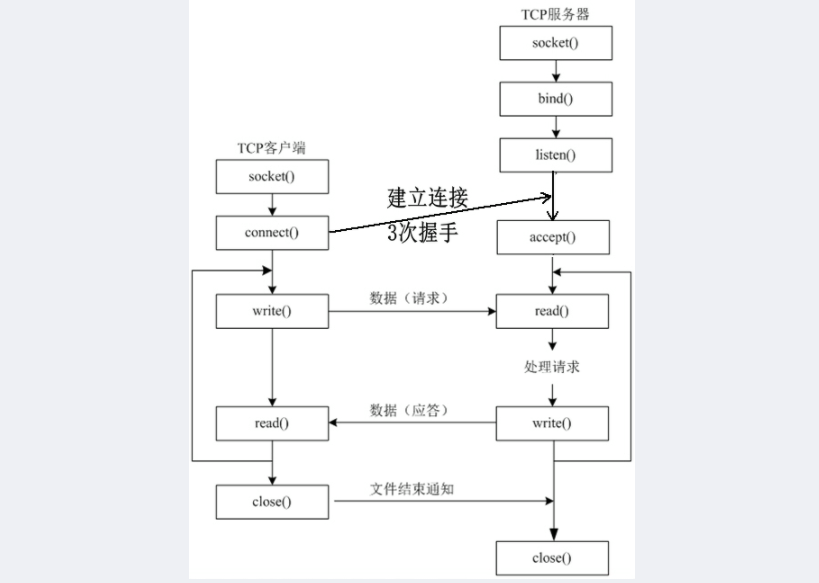
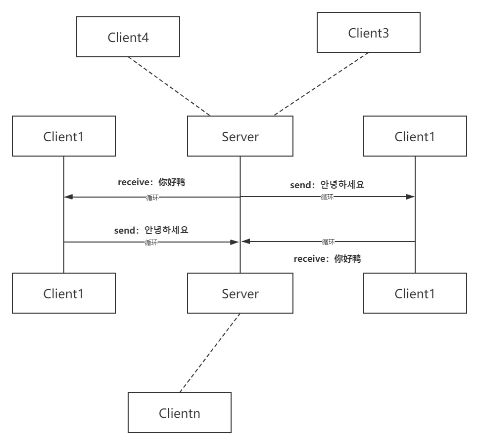
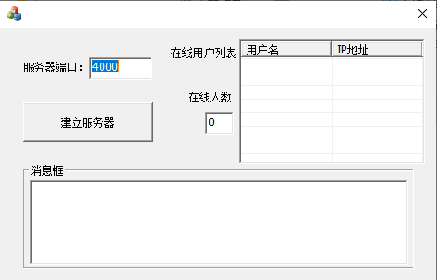
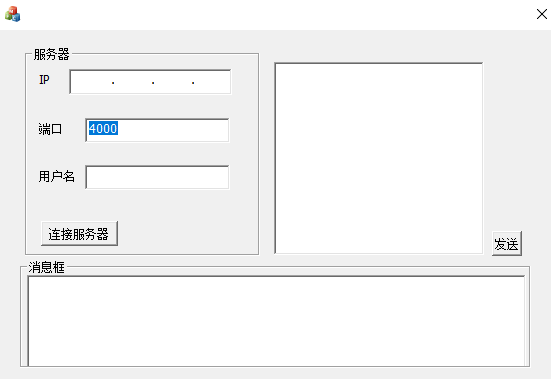
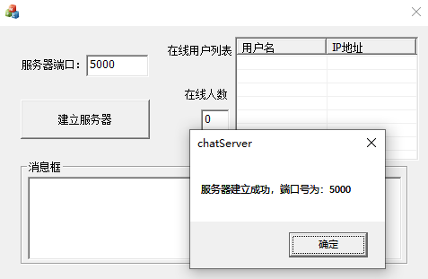
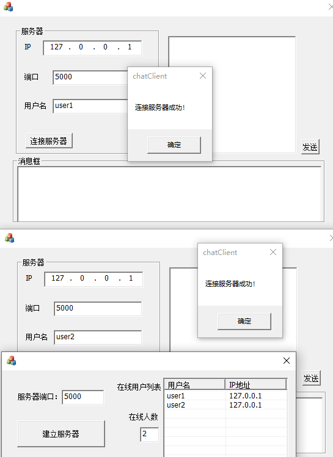
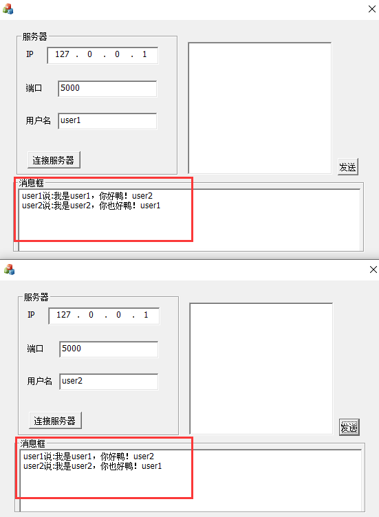

<div align='center'><font size=6>实验一：socket编写聊天程序</font></div>
<div style="margin-left:350px"><font size=4>1811431王鹏</font></div>

***

[TOC]
## 实验要求
* 给出你聊天协议的完整说明。
* 利用C或C++语言，使用基本的Socket 函数完成程序。不允许使用CSocket等封装后的类编写程序。
* 使用流式Socket完成程序。
* 程序应有基本的对话界面，但可以不是图形界面。程序应有正常的退出方式。
* 完成的程序至少应能实现两个用户之间的英文和中文聊天。
* 编写的程序应结构清晰，具有较好的可读性。
* 提交源码和实验报告。

## 前期准备
### `socket`通信原理
#### `socket`函数基本操作
>* `socket()`函数 
>* `bind()`函数 
>* `listen()`、`connect()`函数 
>* `accept()`函数 
>* `read()`、`write()`函数
>* `close()`函数

#### 大致的通信过程
>* 服务器端先初始化`Socket`
>* 服务器通过`bind()`函数绑定端口(声明说我要占用这个端口了， 你们都别用了)
>* 服务器通过`listen()`真正开始对端口进行监听
>* 服务器调用`accept()`函数阻塞，等待客户端的连接(这时候的服务器已经整装待发🤭) 
>* 客户端初始化`socket`，并通过`connect`尝试连接服务器（这里会进行TCP协议的三次握手，因为是第一次实验就不过多叙述啦😁）
>* 客户端通过`send()`函数发送请求
>* 服务器接受请求并处理，然后回应数据给客户端（这样就形成了一个循环，直到有一方断开连接，标志着这次通信的结束👌）
### 通信原理图

### 基本`C/S模型`
>使用TCP协议，支持主机之间连接的、顺序的、可靠的、全双工字节流传输。



## 协议设计
 **传输控制协议**（Transmission Control Protocol，缩写：TCP）是一种面向连接的、可靠的、基于字节流的传输层通信协议，由 IETF 的 RFC 793 定义。在简化的计算机网络 OSI 模型中，它完成第四层传输层所指定的功能。

采用`TCP-IP`协议,因此`socket WSAAP(int af,int type,int protocol)`应为：
```shell
socket{  #socket结构体
    AF_INET; #表示TCP-IP协议，IPV4网络
    SOCK_STEAM; #使用流式客户端和流式服务器
    IPPROPO_TCP #TCP协议
}
```
## 实验过程
>使用`MFC框架`，写了一点点的UI界面
>注释都已经在代码中写好，因此这里对于程序的逻辑具细不再赘述
>实现目标为多人聊天室
### `Server`实现
#### `socket`部分
```c
WSADATA wsadata;
int faultDetails = WSAStartup(MAKEWORD(2, 2), &wsadata);  //定义版本号2.2，先前需定义WSADATA wsaData;用以记录可用Socket详细信息
if (faultDetails!=0) {
	AfxMessageBox("WSAStartup初始化失败");
	return false;
}
serversocket = socket(AF_INET, SOCK_STREAM, IPPROTO_TCP);//采用流式服务端
```
#### `bind`部分
```c
/*
调用bind函数，需要定义一个const sockaddr *addr
我们使用sockaddr_in，再将其进行类型转换
*/
serveraddr.sin_family = AF_INET;   //定义地址族
serveraddr.sin_port = htons(port);	//定义端口号
serveraddr.sin_addr.s_addr = htonl(INADDR_ANY);   //定义32位ip地址 
faultDetails = bind(serversocket, (SOCKADDR*)&serveraddr, sizeof(serveraddr));    //执行bind函数
if (faultDetails != 0) {   //用于抛出异常
	AfxMessageBox("bind执行失败");
	return false;

//faultDetails用于存储调用函数返回的结果（执行成功返回0，不为零则抛出相应异常）
}
```
#### `listen`部分
只要 `TCP` 服务器调用了 `listen()`，客户端就可以通过 `connect()` 和服务器建立连接，而这个连接的过程是由内核完成。
```c
faultDetails = listen(serversocket,4);  //由于目标是多人通信，因此设置等待队列为4，当然也可以更多
if (faultDetails != 0) {
	AfxMessageBox("listen执行失败");
	return false;
}
//faultDetails用于存储调用函数返回的结果（执行成功返回0，不为零则抛出相应异常）
/*
此时服务器已经准备就绪，准备接听客户段的连接
*/
```
***
>`WSAAsyncSelect(serversocket,hwnd, SER_MESSAGE, FD_ACCEPT | FD_READ | FD_CLOSE);`  //在一个`socket`上接收以`windows`消息为基础的网络事件。提供读写数据的异步通知功能
该函数将：
:white_check_mark:自动将套接字设为**阻塞模式**
:white_check_mark:为套接字绑定一个**窗口句柄**
:white_check_mark:当有相应网络事件发生时，向**该窗口**发送消息
***
#### `case:accept`部分
`accept()`函数功能是，从连接队列头部取出一个已经完成的连接，如果这个队列没有已经完成的连接，`accept()`函数就会阻塞，直到取出队列中已完成的用户连接为止。
```c
case FD_ACCEPT:          //case1：接受客户端的请求
client_socket[client_num] = accept(server.serversocket, (SOCKADDR*)&client_addr[client_num], &len);  
//接受一个特定socket请求等待队列中的连接请求
client_num++;   //服务器连接的客户数目加一
UpdateData(false);
break;
```
#### `case:send/recv`部分
进入响应循环
```c
for (i = 0; i < client_num; i++)  //循环寻找此客户端的套接字
{
	if (wParam == client_socket[i])		//找到此客户端的套接字
	{
		recv(client_socket[i], buf, 1024, 0);  //接受客户端发送过来的内容，存到缓存区buf中
		break;
	}
}
//以下在List中显示，
if (buf[0] == 1)			
/*这里实现了一个小逻辑，在客户端发送信息时，如果第一次发送，即执行connect，此时发送的内容为用户名。这里的信息
首字符为1，则将此客户端的用户名和ip地址加到CListCtrl中*/
{
	for(int j=0;j<strlen(buf);j++) buf[j]=buf[j+1];   //将这个信息位1去掉
	client_user.InsertItem(client_num - 1, buf);
	emp = inet_ntoa(client_addr[i].sin_addr);   //获取ip地址信息
	client_user.SetItemText(client_num - 1, 1, temp);		//ip地址信息加到CListCtrl中
}
else
{
	for (int i = 0; i < client_num; i++)
		send(client_socket[i], buf, strlen(buf) + 1, 0);   //如果不是第一次发送，即用户发来的是消息内容，转发到各客户端
}
recvDetails += buf;
recvDetails += (char)0x0d;
recvDetails += (char)0x0a;
temp1 = (CEdit*)GetDlgItem(IDC_EDIT3);  //加和消息内容
temp1->SetWindowText(recvDetails);	   //更新消息框内容
temp1->LineScroll(temp1->GetLineCount());
break;
```
#### `case:close`部分
用户断开连接时，服务器在线人数减一，并将此客户端的套接字从套接字缓冲队列中删除，以及该客户端的ip地址从地址缓冲队列中删除
```c
for (int i = 0; i < client_num; i++)//循环寻找此客户端的套接字
{
	if (wParam == client_socket[i])  //客户端的套接字
	{
		temp = inet_ntoa(client_addr[i].sin_addr);
		for (int j = 0; j < client_user.GetItemCount(); j++)
		{
			if (client_user.GetItemText(j, 1) == temp)
			{
				client_user.DeleteItem(j);		//从列表中删去这一行
				break;
			}
		}
		for (int j = i; j < client_num - 1; j++)   //更新套接字缓冲队列以及客户端地址缓冲队列
		{
			client_socket[j] = client_socket[j + 1];
			client_addr[j] = client_addr[j + 1];
		}
		break;
    }
}
client_num--;   //客户端的数目减少一
UpdateData(false);
```
### `Client`实现
>与`server`大体一致，不过多地赘述代码
#### `socket`部分
```c
WSAStartup(
    MAKEWORD(2, 2),
    &wsaData
);
ClientSocket = socket(AF_INET, SOCK_STREAM, IPPROTO_TCP);
```
#### `connect`部分
对于客户端的 `connect()` 函数，该函数的功能为客户端主动连接服务器，建立连接是通过三次握手，而这个连接的过程是由内核完成，不是这个函数完成的，这个函数的作用仅仅是通知 `Linux` 内核，让 `Linux `内核自动完成 TCP 三次握手连接，最后把连接的结果返回给这个函数的返回值（成功连接为0， 失败为-1）。
客户端的 connect() 函数默认会一直阻塞，直到三次握手成功或超时失败才返回（正常的情况，这个过程很快完成):smile:
```c
serveraddr.sin_port = htons(port);
serveraddr.sin_family = AF_INET;
const char* b = CStringA(ip);
serveraddr.sin_addr.S_un.S_addr = inet_addr(b);
faultDetails= connect(clientsocket, (SOCKADDR*)&serveraddr, sizeof(serveraddr));
return true;
```
#### `case:send/recv`部分
客户端不需要`bind`，也不需要监听`listen`。与服务器连接之后直接进入`send/recv`循环
```c
case FD_READ:
	recv(client.clientsocket, q, 1024, 0);//接受服务器的消息
	recvDetails += q;
	recvDetails += (char)0x0d;
	recvDetails += (char)0x0a;
	temp = (CEdit*)GetDlgItem(IDC_EDIT5);  //加和消息内容
	temp->SetWindowText(recvDetails);	   //更新消息框内容
	temp->LineScroll(temp->GetLineCount());
	break;
```
#### `close`部分
关闭`socket`和`WSAStartup`，并将此讯息发送给服务器。
```c
void CchatClientDlg::OnClose()
{
	// TODO: 在此添加消息处理程序代码和/或调用默认值
	closesocket(client.clientsocket);
	WSACleanup();
	CDialogEx::OnClose();
}
```
## 实验结果/用户手册
#### 服务器端-chatServer

<div align=left></div>
>:white_check_mark:右上角为在线用户的用户名以及ip地址（因为这里是本机操作，所以ip地址一定是`127.0.0.1`），以及在线人数
:white_check_mark:输入端口号并点击`建立服务器`即可建立服务器
:white_check_mark:下面为服务器接收到客户端发来的消息内容

#### 客户端-chatClient
<div align=left></div>
>:white_check_mark:右上角为用户发送消息的消息框
:white_check_mark:输入服务器的ip以及端口号、输入自己的用户名即可以连接服务器
:white_check_mark:下面为聊天室的消息框

#### 结果演示
**建立服务器**

**测试两个用户连接服务器**

**测试中英文聊天**

```shell
实验结果可以看出，中英文都被很好地传到了客户端的另一边
#当然，也可以多个用户共同聊天，因为server在执行listen时，最大连接数为4，这里就不再具体演示啦😝
```
#### 测试环境
* Microsoft Windows 10 专业版 (x64) (version: 17763)
* Visual Studio 2019
* Windows SDK version: 10.0
## References
* [1]张建忠、徐敬东. 计算机网络技术与应用. 北京清华大学学研大厦 A 座:清华大学出版社, 2019.
