<div align='center'><font size=5>实验二：Web服务器配置，HTTP报文捕获</font></div>
<div style="margin-left:350px"><font size=4>1811431王鹏</font></div>

***
# lab2：Web服务器配置，HTTP报文捕获
[TOC]

## 实验要求
* 搭建`Web`服务器（自由选择系统），并制作简单Web页面，包含简单文本信息（至少包含专业、学号、姓名）
* 通过浏览器获取自己编写的`Web`页面，使用`Wireshark`捕获与`Web`服务器的交互过程，并进行简单分析说明
* 提交实验报告
* 实现的额外内容
    :white_check_mark:将网站部署到了百度云服务器上
    >`公网ip`为`http://106.12.217.159/`

    :white_check_mark:分析TCP报文内容(TCP三次握手和四次挥手)
## 写在前边（检查作业过后的心得）
**如下是精简后的抓包结果**
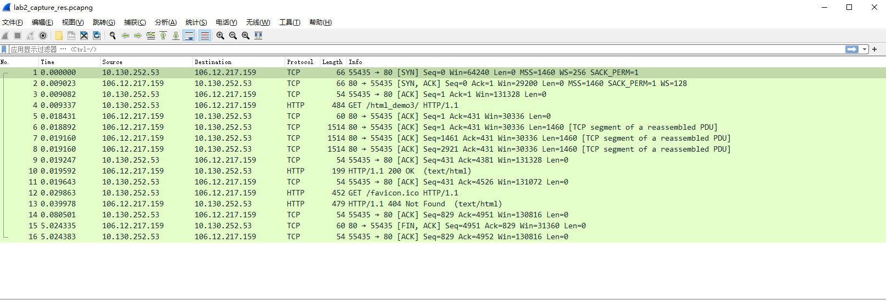
**前三个TCP包是TCP的三次握手,确保两台主机都能够发送和接收消息**
* 本机ip向服务器发送一个序列syn（第一次握手）
* 服务器收到syn序列，设信号ack=syn+1，并发送一段序列syn给本机（第二次握手）
* 本机收到服务器发来的syn序列，设信号ack=syn+1并送回给服务器

**确认可以通信后（即三次握手），客户端发送GET请求(HTTP包)，报文大小为`484-54=430`**
**第四个TCP包，`ACK=1+430=431`，确认收到客户端的GET请求**
**第五至第八个TCP包是将HTML信息分成了三份，通过TCP协议传输，每个报文大小均为`1514-54=1460`**
**第九个TCP包是客户端确认收到服务器分三次发送过来的TCP包，总大小为`1460*3=4380`，故ack=`4380+1=4381`**
**第二个HTTP包是服务器发给客户端的HTTP响应码200，以及html代码的内容**
>之后的传输以此类推，直到最后四次挥手断开连接。😁
## 实验过程
### 服务器搭建（百度云+`Apache`）
>* xshell 
>* xftp
>* 行云管家     ...这些都是使用到的工具
#### 搭建过程
使用`ubuntu`用户登录云服务器后，使用`sudo`命令先对系统里相关软件进行升级，即在命令行输入：`sudo apt-get upgrade`,然后回车，看网络情况而定可能需要等待几秒或几分钟。稍微解释一下，这里的`sudo`命令属于`linux`系统里的使用超级用户权限，`apt-get`属于`ubuntu`里获取网络资源的命令方式，`upgrade`就是更新现有系统里的软件。
**安装`Apache`服务**
同样命令行输入：`sudo apt-get install apache2`，然后回车。同样也是使用超级用户权限来从网络上自动下载安装`apache2`软件，在安装过程中有`yes/no`提示，输入y，表示同意。等待一会，就是提示安装完成。
**测试`HTTP`服务**
`Apache`安装成功后，会在根目录`var`下生成`www/html`目录，这个`html`目录就是存放网站资源的位置，如前述`IIS`提供的`wwwroot`文件夹功能一样。如果需要修改`apache`相关参数，可以去 `/ etc/apache2/apache2.conf`进行修改。此时就可以在`html`目录中使用vi命令来编写一个简单的网页，保存为`index.html`。
#### 上传`html`代码
**使用`root`用户登录云服务器后，直接在命令行输入：**
```shell
[root@centos]yum -y install httpd
```
**稍等片刻，就出现安装成功提示信息。安装成功后，会产生下面两个文件**
```shell
/etc/httpd/conf/httpd.conf  # 主配置文件
/var/www/html                   # 默认网站根目录
```
**启动`http`服务，在`shell`命令行里输入如下代码：**
```shell
service httpd start
```
**和`ubuntu`一样，在命令行窗口进入`/var/www/html`目录下，使用vi命令编辑一个`html`文件，保存为`index.html`**
**然后离开云服务器，在本地电脑上打开浏览器，在地址栏输入:[你的ip地址]()，很快你就可以看见自己写的第一个网页了。**
### 交互过程概览
#### `本机ip`
在`cmd`中输入`ipconfig`获取本机的`ipv4`地址，如下图：

本机`wlan`的`ip`地址为：`10.130.145.207`
#### 封包详细信息(Packet Details Pane)
* `Frame:`   物理层的数据帧概况
* `Ethernet II:` 数据链路层以太网帧头部信息
* `Internet Protocol Version 4:` 互联网层IP包头部信息
* `Transmission Control Protocol:`  传输层T的数据段头部信息，此处是TCP
* `Hypertext Transfer Protocol:`  应用层的信息，此处是HTTP协议
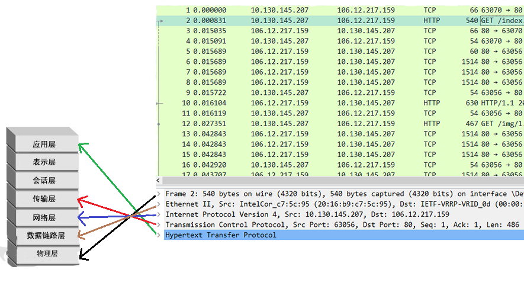
#### 浏览器向服务器发送`HTTP`请求
浏览器向服务器发送HTTP的请求的过程大概分为：
* **1.浏览器通过发送一个`TCP`的包，要求服务器打开连接**
* **2.服务器也通过发送一个包来应答浏览器，告诉浏览器连接打开了**
* **3.浏览器发送一个HTTP的GET请求，这个请求包含了很多的东西了，例如我们常见的cookie和其他的head头信息。**

通过`wireshark`选取其中一条记录，例如`frame number,frame length,`也可以看见源地址和目的地址`ip`，以及各自的端口号，源端口号为63070，目的地址端口号为80以及`Windows size`（大小为64240）等
下图为**请求包：**
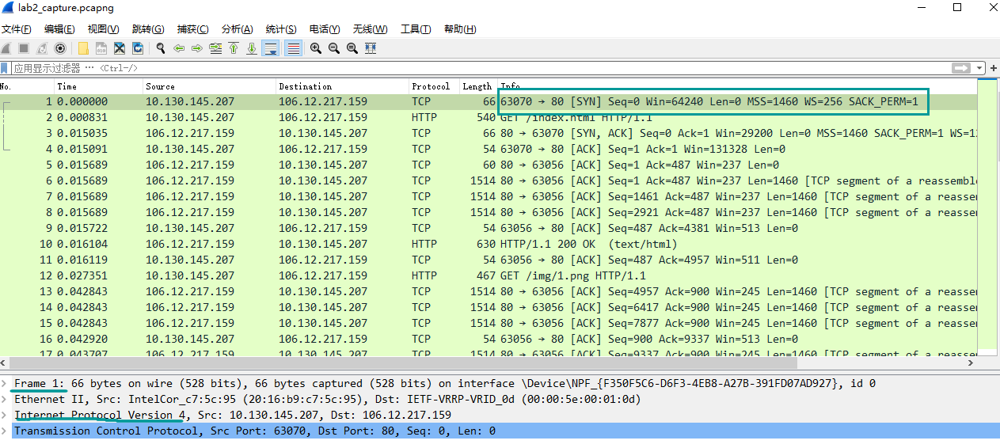
浏览器向服务器发送GET请求，包含`head头，user-agent`等信息(爬虫伪装成用户时需要初始化这些)

#### 服务器响应`HTTP`请求
源地址为服务器公网ip`106.12.217.159`,目的地址为`10.130.145.207`
通过`wireshark`选取其中一条记录，例如`frame number,frame length,`也可以看见源地址和目的地址`ip`，以及各自的端口号，源端口号为80，目的地址端口号为63056以及len（大小为1460）等
下图为**响应包:**

#### 请求报头
请求报文的结构：
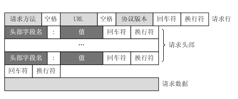
报文分析
```shell
Hypertext Transfer Protocol
    GET /index.html HTTP/1.1\r\n
    Host: 106.12.217.159\r\n
    Connection: keep-alive\r\n
    Pragma: no-cache\r\n
    Cache-Control: no-cache\r\n
    Upgrade-Insecure-Requests: 1\r\n
    User-Agent: Mozilla/5.0 (Windows NT 10.0; Win64; x64) AppleWebKit/537.36 (KHTML, like Gecko) Chrome/86.0.4240.183 Safari/537.36\r\n
    Accept: text/html,application/xhtml+xml,application/xml;q=0.9,image/avif,image/webp,image/apng,*/*;q=0.8,application/signed-exchange;v=b3;q=0.9\r\n
    Accept-Encoding: gzip, deflate\r\n
    Accept-Language: zh-CN,zh;q=0.9\r\n
    [Full request URI: http://106.12.217.159/index.html]
```
* **GET**为请求方式，后面跟请求的内容（这个地方可以看作是一个网页），协议版本`http 1.1`
* **Host**为请求的主机名
* **Connection**客户端与服务端指定的请求，响应有关选项
* **User-Agent**为发送请求的操作系统、及浏览器信息
* **Accept**为客户端可识别的内容类型列表，用于指定客户端接受哪些类型的信息
* **Accept-Encoding**为客户端可识别的数据编码
* **Accept-language**为浏览器所支持的语言类型
>注：请求头方式不同，数据传输不一样，如`GET/Post`
#### 响应报头
响应报文的结构：
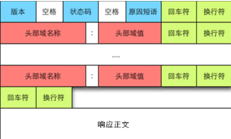
报文分析：
```shell
Hypertext Transfer Protocol
    HTTP/1.1 200 OK\r\n
    Date: Sat, 07 Nov 2020 10:26:33 GMT\r\n
    Server: Apache/2.4.37 (centos)\r\n
    Last-Modified: Fri, 06 Nov 2020 13:37:34 GMT\r\n
    ETag: "122e-5b37050a535ee"\r\n
    Accept-Ranges: bytes\r\n
    Content-Length: 4654\r\n
    Keep-Alive: timeout=5, max=100\r\n
    Connection: Keep-Alive\r\n
    Content-Type: text/html; charset=UTF-8\r\n
    [Request URI: http://106.12.217.159/index.html]
    File Data: 4654 bytes
Line-based text data: text/html (183 lines)
```
* **HTTP/1.1 200**:状态行，200表示客户端请求成功
* **Server**:表示服务器信息
* **Content-length**:消息主体的大小
* **ETag**:资源的特定版本的标识符
* **Last-Modified**:请求资源的最后修改时间
* **Accept-Ranges**:用于标识下载中断时，可以尝试中断了的下载，值一般是0，或byte,0表示不支持
* **Content-Type**:告诉客户端实际返回的内容类型
* **File Data**:响应报文大小
* **Line-based text data**:响应报文的主体，即http传送的内容
### `TCP`报文
#### 封包详细信息
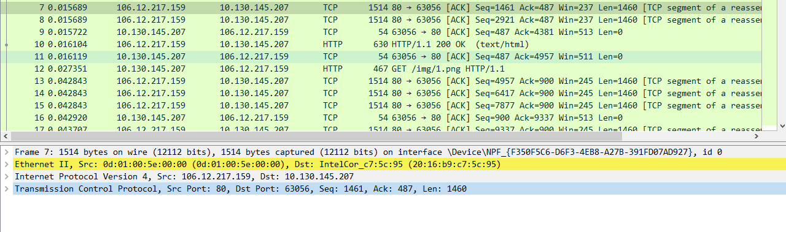
* 第一行，帧`Frame 7`指的是要发送的数据块，其中，所抓帧的序号为7，捕获字节数等于传送字节数：1514字节；
* 第二行，以太网，有线局域网技术，是数据链路层。源地址为`0d:01:00:5e:00:00`；目标地址为`20:16:b9:c7:5c:95`
* 第三行，IPV4协议，也称网际协议，是网络层；源IP地址为`106.12.217.159`,目标IP地址为`10.130.145.207`
* 第四行，TCP协议，也称传输控制协议，是传输层；源端口(80)；目标端口(63056)；序列号(1461)；ACK是TCP数据包首部中的确认标志，对已接收到的TCP报文进行确认，值为1表示确认号有效；长度为487。
#### `Frame`信息分析
```shell
Frame 7: 1514 bytes on wire (12112 bits), 1514 bytes captured (12112 bits) on interface \Device\NPF_{F350F5C6-D6F3-4EB8-A27B-391FD07AD927}, id 0
    Interface id: 0 (\Device\NPF_{F350F5C6-D6F3-4EB8-A27B-391FD07AD927})
    Encapsulation type: Ethernet (1)
    Arrival Time: Nov  7, 2020 18:26:32.553745000 中国标准时间
    [Time shift for this packet: 0.000000000 seconds]
    Epoch Time: 1604744792.553745000 seconds
    [Time delta from previous captured frame: 0.000000000 seconds]
    [Time delta from previous displayed frame: 0.000000000 seconds]
    [Time since reference or first frame: 0.015689000 seconds]
    Frame Number: 7
    Frame Length: 1514 bytes (12112 bits)
    Capture Length: 1514 bytes (12112 bits)
    [Frame is marked: False]
    [Frame is ignored: False]
    [Protocols in frame: eth:ethertype:ip:tcp]
    [Coloring Rule Name: HTTP]
    [Coloring Rule String: http || tcp.port == 80 || http2]
```
* `Arrival Time`：到达时间，值为`Nov  7, 2020 18:26:32.553745000`---**中国标准时间**
* `EPoch Time`:信息出现时间，值为`1604744792.553745000`秒
* `[Time delta from previous captured frame: 0.00000 seconds]`：与之前捕获的数据帧时间差:0秒
`[Time delta from previous displayed frame: 0.00000 seconds]`：与之前显示的帧时间差：0秒
`[Time since reference or first frame: 0.015689000 seconds]`:距参考帧或第一帧的时间差：`0.015689000`秒
* `Frame Number`: 7，帧编号为7；
* `Frame Length`: 1514 bytes (12112 bits)，帧长度为1514字节；
  `Capture Length`:1514 bytes (12112 bits)，捕获到的长度为1514字节；
* `[Frame is marked: False]`，帧标记：无；
  `[Frame is ignored: False]`，帧被忽略：无；
* `[Protocols in frame: eth:ip:tcp]`，协议帧：eth(以太网)、IP、tcp
* `[Coloring Rule Name: TCP]`，色彩规则名称：TCP；
#### `Ethernet II`信息分析
```shell
Ethernet II, Src: 0d:01:00:5e:00:00 (0d:01:00:5e:00:00), Dst: IntelCor_c7:5c:95 (20:16:b9:c7:5c:95)
    Destination: IntelCor_c7:5c:95 (20:16:b9:c7:5c:95)
    Source: 0d:01:00:5e:00:00 (0d:01:00:5e:00:00)
    Type: IPv4 (0x0800)
```
* **Destination**:`IntelCor_c7:5c:95 (20:16:b9:c7:5c:95)`，目标地址为`20:16:b9:c7:5c:95`
* **Source**:`0d:01:00:5e:00:00 (0d:01:00:5e:00:00)`,源地址为`0d:01:00:5e:00:00`
* **Type**:`IPv4 (0x0800)`,类型是ip数据包
#### `ipv4协议`信息分析
```shell
Internet Protocol Version 4, Src: 106.12.217.159, Dst: 10.130.145.207
    0100 .... = Version: 4
    .... 0101 = Header Length: 20 bytes (5)
    Differentiated Services Field: 0x00 (DSCP: CS0, ECN: Not-ECT)
    Total Length: 1500
    Identification: 0xdfac (57260)
    Flags: 0x40, Don't fragment
    Fragment Offset: 0
    Time to Live: 49
    Protocol: TCP (6)
    Header Checksum: 0x8472 [validation disabled]
    [Header checksum status: Unverified]
    Source Address: 106.12.217.159
    Destination Address: 10.130.145.207
```
* **Version**: 4，IP协议版本为`IPv4`；
* **Header length**: 20 bytes，头部数据长度为20字节；
* **Differentiated Services Field**: `0x00 (DSCP 0x00: Default; ECN: 0x00: Not-ECT (Not ECN-Capable Transport))`，区分的服务领域：`0x00` (默认的是`DSCP：0x00`)；
* **Flags**: 0x40 (`Don't Fragment`)，不支持分组
* **Fragment offset**: 0，分组偏移量为0； 
* **Time to live**: 49，TTL，生存时间为49，TTL通常表示包在被丢弃前最多能经过的路由器个数，当数据包传输到一个路由器之后，TTL就自动减1，如果减到0了还没有传送到目标主机，那么就自动丢失。
* **Header checksum**: `0x8472[validation disabled]`，头部校验和
* **Source**:源IP地址为`106.12.217.159`
* **Destination**:目标IP地址为`10.130.145.207`
#### `Trasmission Control Protocol`信息分析
```shell
Transmission Control Protocol, Src Port: 80, Dst Port: 63056, Seq: 1461, Ack: 487, Len: 1460
    Source Port: 80
    Destination Port: 63056
    [Stream index: 1]
    [TCP Segment Len: 1460]
    Sequence Number: 1461    (relative sequence number)
    Sequence Number (raw): 3793976482
    [Next Sequence Number: 2921    (relative sequence number)]
    Acknowledgment Number: 487    (relative ack number)
    Acknowledgment number (raw): 391796350
    0101 .... = Header Length: 20 bytes (5)
    Flags: 0x010 (ACK)
    Window: 237
    [Calculated window size: 237]
    [Window size scaling factor: -1 (unknown)]
    Checksum: 0xb903 [unverified]
    [Checksum Status: Unverified]
    Urgent Pointer: 0
    [SEQ/ACK analysis]
    TCP segment data (1460 bytes)
```
* **端口号**:数据传输的16位源端口号和16位目标端口号(用于寻找发端和收端应用进程)；
* **相对序列号**:该数据包的相对序列号为1461(此序列号用来确定传送数据的正确位置，且序列号用来侦测丢失的包)；下一个数据包的序列号是2921；
* **Acknowledgment number**:是32位确认序列号，值等于1表示数据包收到，确认有效；
* 手动的数据包的头字节长度是20字节；
* **Flags**:含6种标志；`ACK`：确认序号有效；`SYN`：同步序号用来发起一个连接；`FIN`：发端完成发送任务；`RST`：重新连接；`PSH`：接收方应该尽快将这个报文段交给应用层；`URG`：紧急指针(`urgentpointer`)有效；
* **window size**:TCP的流量控制由连接的每一端通过声明的窗口大小来提供。窗口大小为字节数，起始于确认序号字段指明的值，这个值是接收端正期望接收的字节。窗口大小是一个16bit字段，因而窗口大小最大为65536字节，上面显示窗口大小为237字节；
* **Checksum**:16位校验和，检验和覆盖了整个的TCP报文段，由发端计算和存储，并由收端进行验证；
### `HTTP`报文
* **在[交互过程概览](#交互过程概览)部分已经说明，这里不再赘述**😁
### `TCP`三次握手
过程图如下：
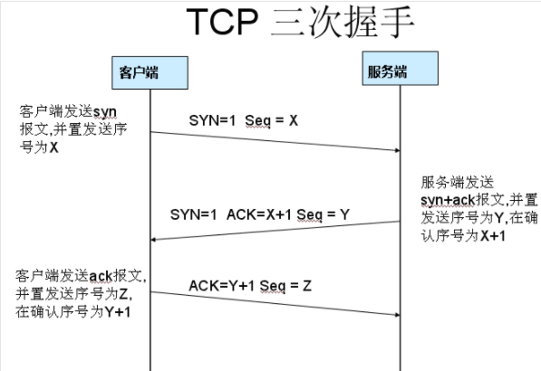v
**:one:第一次握手数据包**
客户端发送一个TCP，标志位为SYN，序列号为0， 代表客户端请求建立连接。
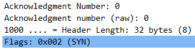
**:two:第二次握手数据包**
服务器发回确认包, 标志位为`SYN,ACK`. 将确认序号(`Acknowledgement Number`)设置为客户的I S N加1以.即`0+1=1`
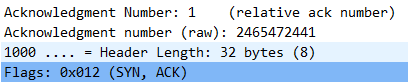
**:three:第三次握手数据包**
客户端再次发送确认包(ACK) SYN标志位为0,ACK标志位为1.并且把服务器发来ACK的序号字段+1,放在确定字段中发送给对方.并且在数据段放写ISN的+1。

### `TCP`四次挥手
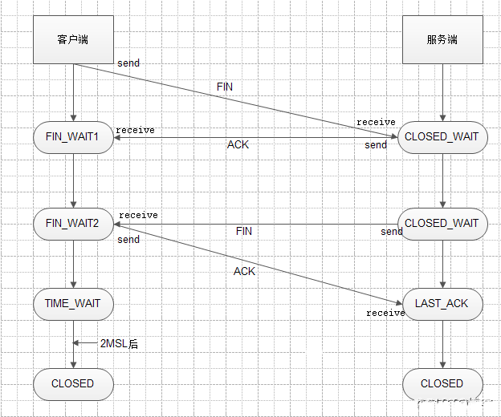
>由于TCP连接是全双工的，断开连接会比建立连接麻烦一点点。
* 1、客户端先向服务器发送`FIN`报文，请求断开连接，其状态变为`FIN_WAIT1；`
* 2、服务器收到`FIN`后向客户端发送`ACK`，服务器的状态围边`CLOSE_WAIT；`
* 3、客户端收到`ACK`后就进入`FIN_WAIT2`状态，此时连接已经断开了一半了。如果服务器还有数据要发送给客户端，就会继续发送；
* 4、直到发完数据，就会发送`FIN`报文，此时服务器进入`LAST_ACK`状态；
* 5、客户端收到服务器的`FIN`后，马上发送`ACK`给服务器，此时客户端进入`TIME_WAIT`状态；
* 6、再过了`2MSL`长的时间后进入`CLOSED`状态。服务器收到客户端的`ACK`就进入`CLOSED`状态。至此，还有一个状态没有出来：`CLOSING`状态。
> * **`CLOSING`状态表示：(客户端发送了`FIN`，但是没有收到服务器的`ACK`，却收到了服务器的`FIN`，这种情况发生在服务器发送的`ACK`丢包的时候，因为网络传输有时会有意外。)**
***
但这里似乎有一点问题：我捕获到的四次挥手TCP包是服务器首先挥手，客户端再挥手，关闭TCP连接
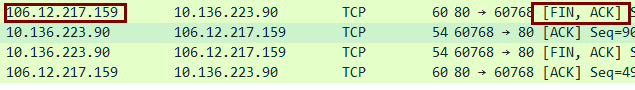
>我猜想应该是，百度云优化了这方面的算法，当服务器给客户端传输完所有数据后，会直接进行第一次挥手（毕竟云服务器端口这些资源还是很宝贵的！！👀）
### 网页呈现结果
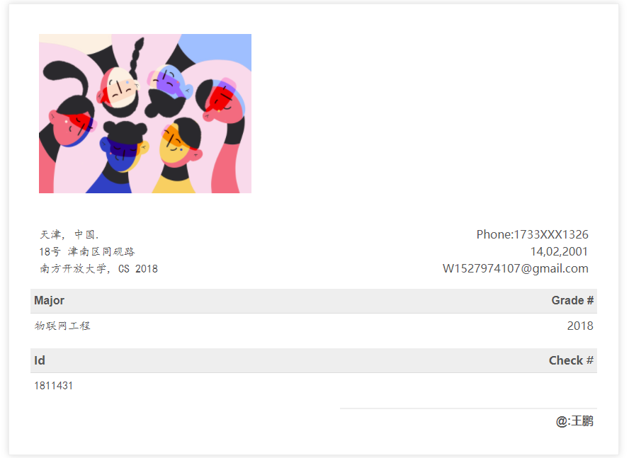
**`TCP Stream Graph`**
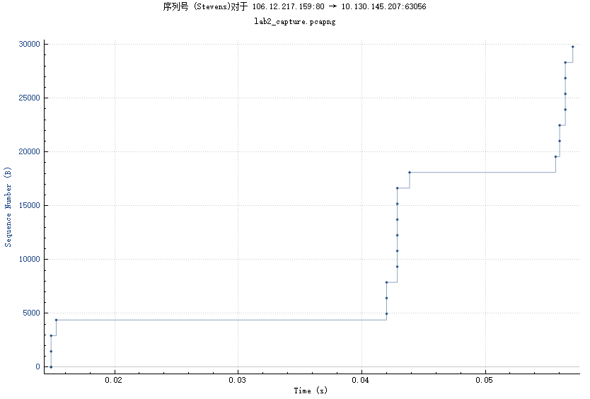
## 总结
标准的HTTP浏览模式如下：
>* `TCP`打开连接（三路握手信号）
>* `HTTP`发送`GET`命令
>* 数据下载到浏览器

* **噢，对了，顺便提一句。放在百度云之前，我用的是iis本机服务器。大致过程如下（新建网站就👌了）**

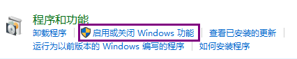
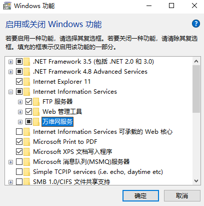
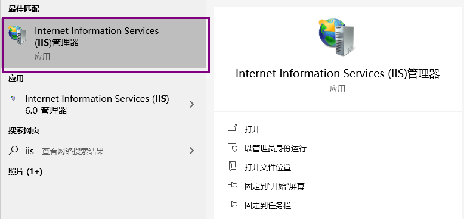

## `References`
* [1] Keith W. Ross James F. Kurose. Computer Network - A Top-down Approach. Pearson,2018.
* [2] Wikipedia. Keepalive. url: https://en.wikipedia.org/wiki/Keepalive. (accessed:7.12.2012)
* [3]张建忠、徐敬东. 计算机网络技术与应用. 北京清华大学学研大厦 A 座:清华大学出版社, 2019.

<font color='red' style="font-family:楷体" size='6'>好了，可以不用往下看了.....🤪</font>
***
***
附上`html`代码：
```html
<!doctype html>
<html>
<head>
    <meta charset="utf-8">
    <title>html_demo</title>
    
    <style>
    .invoice-box {
        max-width: 800px;
        margin: auto;
        padding: 30px;
        border: 1px solid #eee;
        box-shadow: 0 0 10px rgba(0, 0, 0, .15);
        font-size: 16px;
        line-height: 24px;
        font-family: 'Helvetica Neue', 'Helvetica', Helvetica, Arial, sans-serif;
        color: #555;
    }
    
    .invoice-box table {
        width: 100%;
        line-height: inherit;
        text-align: left;
    }
    
    .invoice-box table td {
        padding: 5px;
        vertical-align: top;
    }
    
    .invoice-box table tr td:nth-child(2) {
        text-align: right;
    }
    
    .invoice-box table tr.top table td {
        padding-bottom: 20px;
    }
    
    .invoice-box table tr.top table td.title {
        font-size: 45px;
        line-height: 45px;
        color: #333;
    }
    
    .invoice-box table tr.information table td {
        padding-bottom: 10px;
    }
    
    .invoice-box table tr.heading td {
        background: #eee;
        border-bottom: 1px solid #ddd;
        font-weight: bold;
    }
    
    .invoice-box table tr.details td {
        padding-bottom: 20px;
    }
    
    .invoice-box table tr.item td{
        border-bottom: 1px solid #eee;
    }
    
    .invoice-box table tr.item.last td {
        border-bottom: none;
    }
    
    .invoice-box table tr.total td:nth-child(2) {
        border-top: 2px solid #eee;
        font-weight: bold;
    }
    
    @media only screen and (max-width: 600px) {
        .invoice-box table tr.top table td {
            width: 100%;
            display: block;
            text-align: center;
        }
        
        .invoice-box table tr.information table td {
            width: 100%;
            display: block;
            text-align: center;
        }
    }
    
    /** RTL **/
    .rtl {
        direction: rtl;
        font-family: Tahoma, 'Helvetica Neue', 'Helvetica', Helvetica, Arial, sans-serif;
    }
    
    .rtl table {
        text-align: right;
    }
    
    .rtl table tr td:nth-child(2) {
        text-align: left;
    }
    </style>
</head>

<body>
    <div class="invoice-box">
        <table cellpadding="0" cellspacing="0">
            <tr class="top">
                <td colspan="2">
                    <table>
                        <tr>
                            <td class="title">
                                
                            </td>
                            
                        </tr>
                    </table>
                </td>
            </tr>
            
            <tr class="information">
                <td colspan="2">
                    <table>
                        <tr>
                            <td style="font-family:楷体">
                                天津, 中国.<br>
                                18号 津南区同砚路<br>
                                南方开放大学, CS 2018
                            </td>
                            
                            <td style="font-family:timesnewroman">
                                Phone:1733XXX1326<br>
                                14,02,2001<br>
                                W1527974107@gmail.com
                            </td>
                        </tr>
                    </table>
                </td>
            </tr>
            
            <tr class="heading">
                <td>
                    Major
                </td>
                
                <td>
                    Grade #
                </td>
            </tr>
            
            <tr class="details">
                <td style="font-family:楷体">
                    物联网工程
                </td>
                
                <td style="font-family:timesnewroman">
                    2018
                </td>
            </tr>
            <tr class="heading">
                <td style="font-family:timesnewroman">
                    Id
                </td >
                
                <td style="font-family:timesnewroman">
                    Master #
                </td>
            </tr>
            
            <tr class="details">
                <td style="font-family:楷体">
                    1811431
                </td>
            </tr>
            
            <tr class="total">
                <td></td>
                
                <td>
                   @:王鹏
                </td>
            </tr>
        </table>
    </div>
</body>
</html>

```
