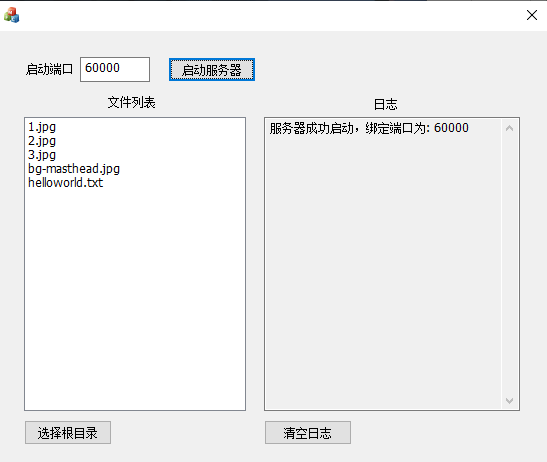
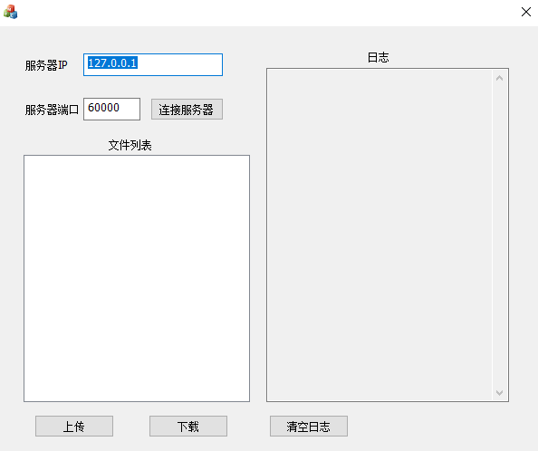
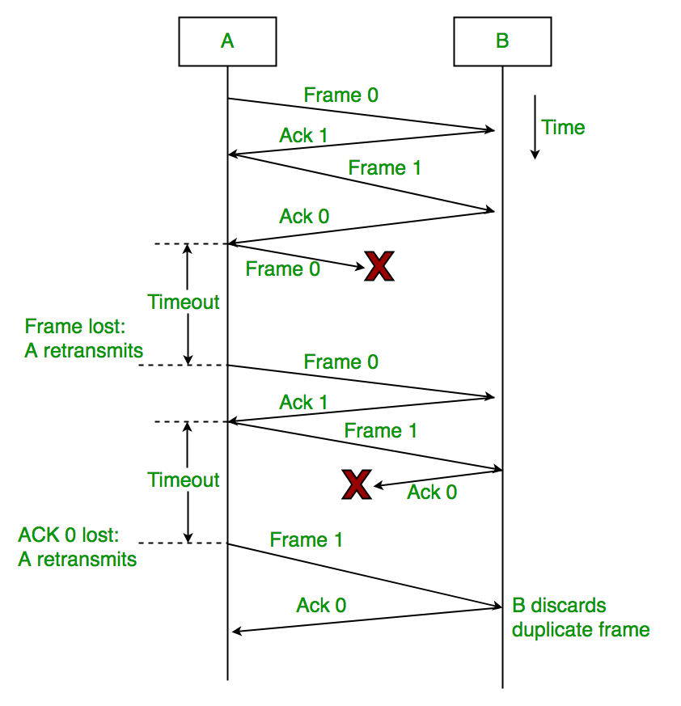

<div align='center'><font size=5>实验3-1：UDP 实现可靠的文件传输（停等协议）</font></div>
<div style="margin-left:350px"><font size=4>1811431王鹏</font></div>

[TOC]
# UDP 实现可靠的文件传输（停等协议)
## 摘要
这是我的上机作业三的实验报告，请老师查阅，谢谢。以下把我设计的协议称为`RUDP`协议（`Reliable User Datagram Protocol`）。
本程序的特点有:
* **支持多用户同时下载或上传文件**
* **差错检验**
* **超时重传**
* **可靠传输机制**

**关键字**：UDP、可靠传输、RUDP、差错检验、超时重传
**程序的基本要求：**
1)下层使用UDP 协议（即使用数据报套接字完成本次程序）；
2)完成客户端和服务器端程序；
3)建立连接、差错检测、确认重传
4)实现可靠的文件传输：能可靠下载文件，能同时下载文件。
## 用户手册
### 服务器

**服务器界面介绍:**
1. 选择根目录：文件列表区。展示服务器根目录里的所有文件。
2. 日志：服务器日志区。显示服务器日志。
3. 启动端口：选择服务器的监听端口号。
4. 启动服务器按钮：服务器开启按钮。需要在选择文件夹及端口号之后再点击。
5. 选择根目录按钮：选择服务器的根目录。
6. 清空日志按钮：清空日志区。
### 客户端

**客户端界面介绍:**
1. 文件列表：文件列表区。展示服务器根目录里的所有文件。
2. 清空日志：客户端日志区。显示客户端日志。
3. 服务器IP：输入服务器的IP 地址。
4. 服务器端口：输入服务器的端口号。
5. 连接服务器：连接服务器按钮。在填入Server IP 和Server Port 后点击。
6. 下载按钮：下载文件按钮。下载在File List 中已选中的文件。
7. 上传按钮：上传文件按钮。上传指定文件到服务器根目录。
8. 清空日志按钮：清空日志区。
## `RUDP协议原理介绍`
**RUDP 属于停等协议。基本思想:**
1. 传输数据时，发送方每发送一次数据后，都必须等待接收方发回的确认数据报被自己收到后，才能发出下一个数据报。
2. 如果发送的数据丢失或发回的确认数据报文丢失，发送方会重发上一次发送的数据。协议原理图可参考下图。

## `RUDP协议实现介绍`
### 建立连接
使用套接字接口：CAsyncSocket 套接字类
**服务器初始化：**
```cpp
BOOL createFlag = usock.Create(m_port, SOCK_DGRAM, FD_CLOSE | FD_READ | FD_ACCEPT | FD_CONNECT);//数据报服务端，即底层使用UDP协议
//在一个socket 上接收以windows 消息为基础的网络事件。提供读写数据的异步通知功能 
// 生成失败会报错
if (createFlag == 0)
{
	MessageBox(_T("Socket create failed."));
	usock.Close();
	return;
}

CString t;
t.Format(_T("服务器成功启动，绑定端口为: %d\r\n"), m_port);
// 更新日志
displayString(m_log, t);
```
**客户端连接服务器：**
```cpp
int port = findNextPort() + 60000;
//ClientSocket skt;
BOOL Flag = usock.Create(port, SOCK_DGRAM, FD_READ | FD_WRITE | FD_OOB | FD_ACCEPT | FD_CONNECT| FD_CLOSE);
while (!Flag) {//端口被占用的话就遍历端口数组
	port = findNextPort() + 60000;
	Flag = usock.Create(port, SOCK_DGRAM, FD_READ | FD_WRITE | FD_OOB | FD_ACCEPT | FD_CONNECT | FD_CLOSE);
}

Flag = usock.Connect(m_ip, m_port);
CString t;
t.Format(_T("Try to connect %s:%d"), m_ip, m_port);
// 更新日志
displayString(m_log, t);
```
### 差错检验
为了进一步提高可靠性，在本次实验中，自行设计了数据报文的报文首部，在其中添加了对数据字段所有数据的校验和计算的结果存储位置，在数据报文的接收端首先会对数据进行校验和的计算检查工作，确认无误之后才会进一步进行分析，否则将抛弃出错报文。
差错检验功能主要依靠报文头部中的校验和为和校验和计算函数，校验和计算函数如下:
```cpp
unsigned short ChecksumCompute(unsigned short * buffer, int size) {
	unsigned long cksum = 0;
	while (size > 1)
	{
		cksum += *buffer++;
		size -= sizeof(unsigned short);
	}
	if (size)
	{
		cksum += *(unsigned char *)buffer;
	}
	cksum = (cksum >> 16) + (cksum & 0xffff);
	cksum += (cksum >> 16);
	return (unsigned short)(~cksum);
}
```
利用校验和计算函数和校验和位，在接受到报文数据之后，提取校验和为和重新计算的校验和进行比对，如果无误则继续处理，否则丢弃报文并报告记录日志。相关代码如下所示：
```cpp
if (ChecksumCompute((unsigned short*)m_szBuffer, nRead) != 0)
{
	pdlg->displayString(pdlg->m_log, CString("ACK包校验和不为0，丢弃该包"));
	return false;
}
```
### 超时重传
在发udp包前，记录当前时间（开始等待ACK），`elapsed_secs`用于记录等了ACK多少时间了,过了0.2秒就重传，过了20次未收到ACK就终止传输
```cpp
........
	clock_t begin = clock();//记录当前时间（开始等待ACK）
	double elapsed_secs = 0;//elapsed_secs用于记录等了ACK多少时间了
	while (1) {//进入死循环，等待ACK
		bool crecv = waitACK(skt,hd);//传入服务器socket和头部信息
		if (!crecv) {//如果没有收到ACK
			crecv = waitACK(skt,hd);//继续等ACK
			clock_t end = clock();
			elapsed_secs = double(end - begin) / CLOCKS_PER_SEC;//过了0.2秒就重传，过了20次未收到ACK就终止传输
			if (retransNum >= 20) {//重传次数>=20时，认为文件传输完毕但没有收到ack，或者认为客户端死，结束传输。
				break;
			}
			if (elapsed_secs >= 0.5) {
				CString out;
				out.Format(L": %s  \n", L"收不到ack，服务器正在重传");
				out = L"\r\n" + out;
				pdlg->displayString(pdlg->m_log, out);
				in.seekg(curPos);//重置文件指针至之前读取位置
				retransNum++;//重传次数+1
				break;
			}
		}
		else {//收到ACK
			seq++;//序列号+1
			retransNum = 0;//重置重传次数
			CString file(hd->fileName);//显示日志记录
			CString out;
			out.Format(L":(ACK) %d  \n", hd->seq);
			out = L"\r\n" + out;
			out = out + file;
			pdlg->displayString(pdlg->m_log, out);
			break;
		}
	}
	if (retransNum >= 20) {//重传次数>=20时，认为文件传输完毕但没有收到ack，或者认为客户端已死。
		CString file(hd->fileName);//显示日志记录
		CString out;
		out.Format(L"终止传输:\n");
		out = L"\r\n" + out;
		out = out + file;
		pdlg->displayString(pdlg->m_log, out);
		break;
	}
........
```
### 停等机制
只有接到上一个包的ack返回包，才会发送下一个包
```cpp
while (!in.eof()) {
    ....
		while (1) {//进入死循环，等待ACK
		bool crecv = waitACK(skt,hd);//传入服务器socket和头部信息
		if (!crecv) {//如果没有收到ACK
			crecv = waitACK(skt,hd);//继续等ACK
            ....
        }
        else {
			seq++;//序列号+1
			retransNum = 0;//重置重传次数
			CString file(hd->fileName);//显示日志记录
        }
        ....
    }
}    
```
`waitack`函数如下：
```cpp
bool ServerSocket::waitACK(ServerSocket &skt,header* hd)
{
	CRUDPServerDlg* pdlg = (CRUDPServerDlg*)AfxGetApp()->GetMainWnd();
	// A buffer for the incoming data.
	char m_szBuffer[4096];
	// What ReceiveFrom Returns.
	int nRead;
	CString host, strp;
	UINT port;
	// 获取接收信息
	//Sleep(15);
	while (1) {
		nRead = skt.ReceiveFrom(m_szBuffer, 4096, host, port, 0);
		if (nRead > 0) break;
	}
	if (ChecksumCompute((unsigned short*)m_szBuffer, nRead) != 0)
	{
		pdlg->displayString(pdlg->m_log, CString("ACK包校验和不为0，丢弃该包"));
		return false;
	}
	// 按 ReceiveFrom 的返回值来判断如何继续
	CString out; int ierr;
	switch (nRead) {
	case 0:
		// this->Close();
		break;
	case SOCKET_ERROR:
		ierr = GetLastError();
		if (ierr== WSAEWOULDBLOCK) {  // currently no data available
			Sleep(5);  // wait and try again
			break;
		}
		//out.Format(L"error: %d", ierr);
		//AfxMessageBox(out);
		//skt.Close();
	default:
		header* recvhd = (header*)(m_szBuffer);	//reinterpret_cast强制类型转换将char型转换为header型，因为ack包传来的只有header
		if (recvhd->isAck) {
			if (hd->clientPort == recvhd->clientPort && hd->serverPort == recvhd->serverPort && hd->seq == recvhd->seq) {
				return true;//ACK的相关信息和当前头部信息对应的话，返回true。传输下一个数据报
			}
		}
	}
	return false;
}
```
**客户端和服务器的初始连接**
**服务器**：首先我们需要通过“Open Folder”按钮选择服务器的根目录（此时把文件名装入一个deque 容器中），然后在“port”编辑框中写入端口号，点击”start” 按钮后服务器正式开启服务。
**客户端**：输入服务器的IP 和端口号后，单击“Connect”按钮。此时，客户端向服务器发送了一个100 请求，请求服务器文件列表。
**服务器**：服务器收到来自服务器的100 请求后，发送200 文件列表应答给客户端。
**客户端**：客户端收到200 应答后，使用200 应答报文中的信息更新自己的文件列表容器，刷新File list 列表框。客户端和服务器的初始连接过程结束。

**客户端请求下载文件**
**客户端**：用户在File list 中选中想要获取的文件（可多选），单击“Download”。此时，对于选中的每一个文件，客户端逐一地开启一个新的线程和端口向服务器的原端口发送110文件请求，格式为110+ 请求文件在列表中的序号。
**服务器**：每收到一个110 文件请求，服务器逐一地开启一个新的线程和端口来响应。
**服务器**：在服务器的下载线程中，线程根据110 请求的文件序号查找文件的路径，再把文件读入文件流中。设置发送数据的报头，在数据报头之后的第一个位置读入数据本身，完成即将发送的数据的组装，发送数据，等待客户端的确认报文。
**客户端**：客户端收到正确的报文（客户端端口号、服务器端端口号、序列号都相同的报文）后，将接收到的数据写入文件流，然后组装一个仅含有确认信息的数据报，发往服务器；如果没有收到正确的数据报文，客户端重发上一个收到的正确报文对应的确认报文。
**服务器**：服务器收到正确的确认报文后，继续发送这次应发送数据；如果服务器在发送数据后0.5 秒内没有收到正确的报文，服务器重发上一次发送的数据；如果服务器线程连续发送了30 次同样的数据，就认为文件传输完毕但没有收到确认报文，或者认为客户端已死，结束传输。

**客户端上传文件**
**客户端**：单击“Upload”按钮后，用户可以选择一个文件发往服务器的根目录。结束文件的选择之后，客户端开启一个新的线程和端口向服务器的原端口发送120 上传请求。
**服务器**：每收到一个120 上传请求，服务器逐一地开启一个新的线程和端口来响应，并向客户端的对应端口发送220 上传回复，格式为220+ 对应生成的服务器端口，意思是回复客户端的上传请求，通知客户端自己将使serverPort 端口接收文件。以下部分的代码和下载部分大同小异，为了精简文档，就不贴出了。请老师打开VisualStudio 参阅。
**客户端**：每收到一个220 上传应答，对应客户端线程逐一地开始向服务器对应端口传输文件。
**客户端**：在客户端的上传线程中，线程根据220 应答的服务器端口号传输文件，把文件读入文件流中。设置发送数据的报头，在数据报头之后的第一个位置读入数据本身，完成即将发送的数据的组装，发送数据，等待服务器的确认报文。
**服务器**：服务器收到正确的报文（客户端端口号、服务器端端口号、序列号都相同的报文）后，将接收到的数据写入文件流，然后组装一个仅含有确认信息的数据报，发往客户端；如果没有收到正确的数据报文，服务器重发上一个收到的正确报文对应的确认报文。
**客户端**：客户端收到正确的确认报文后，继续发送这次应发送数据；如果客户端在发送数据后0.5 秒内没有收到正确的报文，客户端重发上一次发送的数据；如果客户端线程连续发送了30 次同样的数据，就认为文件传输完毕但没有收到确认报文，或者认为服务器已死，结束传输。
## 关键部分源码
（”...” **部分表示省略**）
此部分分为2 个大节，每个大节有4 个小节，其中第一个小节展示函数和变量的声明，后三个小节每个小节解释一个具体功能的实现。每小节开头都有**代码摘要**，粗略地展示了功能的实现步骤。
### 服务器
#### 头文件（函数和变量的声明）
**代码摘要**：函数和变量的声明。
因为很多变量都在头文件中声明，所以为了便于理解，首先贴上Socket 类及对话框类头文件的代码。
```cpp
class CRUDPServerDlg : public CDialogEx
{
...
public:
void displayString(CEdit& editCtrl , CString& str);
CString FicowGetDirectory();// 选择文件夹， 并返回路径
void ShowFile();// 将文件显示在列表框控件中
void RecursiveFindFile(CString strRootPath , bool isRecursive);// 查找文件夹下的所有文件
// 打开文件夹按钮
CButton m_folder;
// 开始按钮
CButton m_start;
// 服务器日志编辑框控件
CEdit m_log;
// 服务器端口， 默认选择60000 端口
int m_port;
// 文件列表控件
CListBox m_fileList;
afx_msg void OnEnChangeEditPort();
afx_msg void OnBnClickedButtonFolder ();
deque <CString > str_fileDeque;// 文件双向队列-deque
afx_msg void OnBnClickedButtonStart ();
int findNextPort();
bool nextPortList [5535];// 下一个将被分配的端口, 从60001 开始分配
//nextPortList[i] == false 表示端口60001+i 没有被本程序分配
//deque <ServerSocket >socketDeque ;// 存储socket 的双端队列
map <int , int >clientToServerMap;// 客户端的端口和服务器端口的映射
ServerSocket usock;// 生成UDP Socket （ 用作起始连接） Port =60000
CString strDirectoryPath;// 打开的文件目录
bool receiveFile(ServerSocket& skt , int clientPort);
map <string , int >fileSeq;// 记录哪个文件到了哪个seq ， 用于判断重复seq
afx_msg void OnBnClickedButtonClear ();
};
#define MAX_PACKET 7000
struct header {
char fileName [260];//Windows 下完全限定文件名必须少于260 个字符， 目录名必须小于248 个字符。
bool isAck;
int seq;
int clientPort;
int serverPort;
int dataLen;
int totalLen;
};
struct tempForDownAndUp {// 为了开启一个线程随意创建的临时变量
CString strData;
int clientPort;
int initClientPort;
};
class ServerSocket : public CAsyncSocket
{
public:
ServerSocket();
virtual ~ServerSocket();
virtual void OnSend(int nErrorCode);
bool waitACK(ServerSocket& skt , header* hd);
CString initReply100();
void Reply110(CString str , int clientPort , int serverPort , ServerSocket& skt);
void Reply120(CString str , int clientPort , int serverPort , ServerSocket& skt);
char* CStringToPChar(CString str);
virtual void OnReceive(int nErrorCode);
virtual void OnAccept(int nErrorCode);
bool processFile(ServerSocket& skt , char* raw , int clientPort);
std::map <int , std::vector <int > > clientPortMap;
};
```
#### 服务器初始化
**代码摘要**：通过 **选择根目录** 按钮选择服务器的根目录（此时把文件名装入一个deque容器中），然后在“port”编辑框中写入端口号，点击”start” 按钮后服务器正式开启服务。这里用到了6 个不同的函数。

`CString CRUDPServerDlg::FicowGetDirectory()`
* 选择文件夹，并返回路径。

`void CRUDPServerDlg::RecursiveFindFile(CString strRootPath, bool isRecursive =false)`
* 查找文件夹下的所有文件。

`void CRUDPServerDlg::ShowFile()`
* 在列表框中展示所有文件。

`void CRUDPServerDlg::OnBnClickedButtonFolder()`
* 综合上述函数。

`void CRUDPServerDlg::OnEnChangeEditPort()`
* 实时更新填入的端口号

`void CRUDPServerDlg::OnBnClickedButtonStart()`
* 开启服务器的初始端口进行服务。

```cpp
// 选择文件夹， 并返回路径
CString CRUDPServerDlg::FicowGetDirectory()
{
	BROWSEINFO bi;  //BROWSEINFO结构中包含有用户选中目录的重要信息
	TCHAR name[MAX_PATH];  //定义编译器所支持的最长全路径名的长度。
	ZeroMemory(&bi, sizeof(BROWSEINFO));	//内存初始化为0
	bi.hwndOwner = AfxGetMainWnd()->GetSafeHwnd();
	bi.pszDisplayName = name;
	bi.lpszTitle = _T("选择文件夹目录");
	bi.ulFlags = BIF_RETURNFSANCESTORS;
	LPITEMIDLIST idl = SHBrowseForFolder(&bi);	//打开文件目录对话框
	if (idl == NULL)
		return _T("");
	CString strDirectoryPath;
	SHGetPathFromIDList(idl, strDirectoryPath.GetBuffer(MAX_PATH));	 //如果选择了路径则复制路径,返回路径长度
	strDirectoryPath.ReleaseBuffer();	//更新字符串的长度
	if (strDirectoryPath.IsEmpty())
		return _T("");
	if (strDirectoryPath.Right(1) != "\\") //从右边开始取字符串
		strDirectoryPath += "\\";

	return strDirectoryPath;
}

void CRUDPServerDlg::ShowFile()
{
	m_fileList.ResetContent();	//清空fileList中的内容
	unsigned sz = str_fileDeque.size();
	for (unsigned i = 0; i < sz; i++)
	{
		m_fileList.InsertString(-1, str_fileDeque[i]); //索引号,设定为-1时,项目条被插入到列表的末尾;
	}
}

//查找文件夹下的所有文件
void CRUDPServerDlg::RecursiveFindFile(CString strRootPath, bool isRecursive = false)
{
	/*
	   主要是CFileFind类的使用。
	   重要方法;
	   FindFile()
	   FindNextFile()
	*/
	// strRootPath 为目录名;  
	CFileFind finder;
	CString FilePath;
	if (strRootPath.Right(1) != "/")
		strRootPath += "/";
	strRootPath += "*.*";  //表示显示所有命名、所有类型的文件

	BOOL res = finder.FindFile(strRootPath);    // 开始遍历root文件夹下有没有文件或文件夹;  
	while (res)       // res为1，表示仍有nextFile;  
	{
		res = finder.FindNextFile(); //遍历目录或文件时，判断当前目录下是否有下一个目录或文件
		FilePath = finder.GetFilePath();  //获得文件路径

		if (finder.IsDots())  continue;       // 如果文件为“.”或“..”，则跳过本次循环;  

		if (finder.IsDirectory())     // 找到的是文件夹;  
		{
			if(isRecursive)
				RecursiveFindFile(FilePath);        // 递归;  
		}
		else if (!finder.IsDirectory())       // 找到的是文件;  
		{
			str_fileDeque.push_back((finder.GetFileName()));    // 显示文件名文件双向队列-deque
		}
	}
}
void CRUDPServerDlg::OnEnChangeEditPort()
{
	// TODO:  如果该控件是 RICHEDIT 控件，它将不
	// 发送此通知，除非重写 CDialogEx::OnInitDialog()
	// 函数并调用 CRichEditCtrl().SetEventMask()，
	// 同时将 ENM_CHANGE 标志“或”运算到掩码中。
	// TODO:  在此添加控件通知处理程序代码

	UpdateData(true);
}


void CRUDPServerDlg::OnBnClickedButtonFolder()
{
	// TODO: 在此添加控件通知处理程序代码

	str_fileDeque.clear();//每次打开前清空deque
	strDirectoryPath = FicowGetDirectory();//选择文件夹，并返回路径
	RecursiveFindFile(strDirectoryPath);
	ShowFile();
}


void CRUDPServerDlg::OnBnClickedButtonStart()
{
	// TODO: 在此添加控件通知处理程序代码

	BOOL createFlag = usock.Create(m_port, SOCK_DGRAM, FD_CLOSE | FD_READ | FD_ACCEPT | FD_CONNECT);	//数据报服务端，即底层使用UDP协议
	//在一个socket 上接收以windows 消息为基础的网络事件。提供读写数据的异步通知功能 
	// 生成失败会报错
	if (createFlag == 0)
	{
		MessageBox(_T("Socket create failed."));
		usock.Close();
		return;
	}

	CString t;
	t.Format(_T("服务器成功启动，绑定端口为: %d\r\n"), m_port);
	// 更新日志
	displayString(m_log, t);

}
```
#### 服务器回应客户端的初始连接请求（发送200 应答）
**代码摘要**：服务器收到来自服务器的100 请求后，发送200 文件列表应答给客户端。
使用函数介绍：
`CString ServerSocket::initReply100()`
* 服务器构建200 应答报文。

`void ServerSocket::OnReceive(int nErrorCode)`
* 服务器回复客户端的连接请求。
```cpp
CString ServerSocket::initReply100() {	//收到来自服务器的100 请求后，发送200 文件列表应答给客户端
	CRUDPServerDlg* pdlg = (CRUDPServerDlg*)AfxGetApp()->GetMainWnd(); //应用程序活动主窗口的指针
	CString s = L"200 ";//回应“100”请求

	for (size_t i = 0; i < pdlg->str_fileDeque.size(); ++i) {
		s += pdlg->str_fileDeque[i];
		s += L"/";//每个文件之间用'/'间隔
	}
	return s;
}
void ServerSocket::OnReceive(int nErrorCode)
{
    ...
	default:
		// terminate the string
		m_szBuffer[nRead] = _T('\0');
		char* temp = &m_szBuffer[sizeof(struct header)];
		CString strTextOut;
		strTextOut = string(temp).c_str();
		if (strTextOut.Left(3) == "100") {//收到客户端的"100"请求 如果前三个字符为1、0、0，代表客户端传来的是100请求
			CString s = initReply100();//获取文件列表，构建即将发送的数据x
			pdlg->displayString(pdlg->m_log, s);
			char temp[1024];
			int len = WideCharToMultiByte(CP_ACP, 0, s , s.GetLength(), NULL, 0, NULL, NULL);
			WideCharToMultiByte(CP_ACP, 0, s, s.GetLength(), temp, len, NULL, NULL);
			char retchar[4096];
			// clientPortMap[port];//插入空的键
			header* hd = (header*)retchar;
			hd->dataLen = strlen((char*)temp);
			hd->totalLen = hd->dataLen + sizeof(struct header);
			copyData(temp, (retchar + sizeof(header)), hd->dataLen);
			hd->checkSum = 0;
			hd->checkSum = ChecksumCompute((unsigned short*)hd, hd->totalLen);
			pdlg->usock.SendTo(retchar, hd->totalLen, port, _T("127.0.0.1"), 0);  //传出200请求以及选中的文件
		/*
		参数一：发送数据的缓冲区
		参数二：缓冲区的字节长度
		参数三：标识套接字应用程序的端口
		参数四：此对象与套接字的网络地址
		参数五：指定调用了的方式。一般为0
		*/
		}
}
```
#### 服务器回应客户端的下载请求
使用函数介绍：
`void ServerSocket::OnReceive(int nErrorCode)`
* 服务器接收客户端的110 请求。
* 每收到一个110 文件请求，服务器逐一地开启一个新的线程和端口来响应。

`void ServerSocket::Reply110(CString s, int clientPort, int serverPort, ServerSocket&skt)`
* 线程根据110 请求的文件序号查找文件的路径，再把文件读入文件流中。设置发送数据的报头，在数据报头之后的第一个位置读入数据本身，完成即将发送的数据的组装，发送数据，等待客户端的确认报文。

`bool ServerSocket::waitACK(ServerSocket& skt,header* hd)`
* 等待客户端的确认报文。

```cpp
		else if (strTextOut.Left(3) == "110") {//收到客户端的"110"请求
			tempForDownAndUp* t = new tempForDownAndUp;
			t->clientPort = port;
			t->strData = strTextOut;

			// 调用 AfxBeginThread() 函数启动工作者线程
			// AfxBeginThread() 函数将返回一个指向新创建线程对象的指针
			//CRUDPClientDlg* p = (CRUDPClientDlg*)AfxGetMainWnd();
			CWinThread* m_Downloader = AfxBeginThread(
				(AFX_THREADPROC)Downloader, // pfnThreadProc：指向工作者线程的控制函数，它的值不能为NULL
				t,
				THREAD_PRIORITY_NORMAL // 用于指定线程的优先级
			);
			if (m_Downloader != nullptr) {
			}
			else {
				AfxMessageBox(L"Download Thread Create Failed.");
			}
		}
void ServerSocket::Reply110(CString s, int clientPort, int serverPort, ServerSocket& skt) {
	//获取客户端想要接收的文件的序号
	int pos = s.Find(L" ");		//传过来的是文件的索引
	CString fileNumStr = s.Mid(pos + 1);	//截取空格后的字符串
	int fileNum = _ttoi(fileNumStr);	//将CString转换成整形

	//设置文件路径和文件流
	CRUDPServerDlg* pdlg = (CRUDPServerDlg*)AfxGetApp()->GetMainWnd();
	CString file = pdlg->str_fileDeque[fileNum];
	CString filePath = pdlg->strDirectoryPath + file;	//待写文件的路径
	ifstream in(filePath, ifstream::ate | ifstream::binary);
	int fileSize=in.tellg();//获取文件大小

	in.seekg(0);//设置文件指针，指向文件开头

	int splice = int(fileSize / MAX_PACKET) + 1;//这个文件会被分成多少片。
	u_char send[50000];//声明要发送的数组
	header* hd = (header*)send;//初始化header
	hd->clientPort = clientPort;
	hd->serverPort = serverPort;
	/*int nameStart = filePath.ReverseFind(_T('\\')) + 1;
	for (int i = nameStart, j = 0; i < filePath.GetLength(); i++,j++) {
		hd->fileName[j] = filePath[i];
	}
	hd->fileName[filePath.GetLength() - nameStart] = '\0';*/

	//给hd->fileName赋值，支持多国语言文件名
	int ns = filePath.ReverseFind(_T('\\')) + 1;
	int nameLen = filePath.GetLength() - ns;
	CString name = filePath.Right(nameLen);
	//CString cs("Hello");
	// Convert a TCHAR string to a LPCSTR
	CT2CA pszConvertedAnsiString(name);
	// construct a std::string using the LPCSTR input
	std::string strFileName(pszConvertedAnsiString);
	//string s = "hello world";
	const char* p = strFileName.c_str();
	memcpy(&hd->fileName[0], p, strlen(p));
	hd->fileName[strlen(p)] = '\0';

	vector<char> buffer(MAX_PACKET, 0); //声明读取文件时用到的vector容器，且内容全置为0

	int seq = 0;//初始化发送序列号
	int retransNum = 0;// 重传次数，下面会用到，重传次数>=30时，认为文件传输完毕但没有收到ack，或者认为客户端已死，结束传输。
	while (!in.eof()) {
		int restData= fileSize - seq * buffer.capacity();//记录还有多少数据等待发送
		int curPos = in.tellg();//保存当前文件读取位置，便于重传

		hd->seq = seq;//设置头部序列号
		hd->isAck = false;//表明这个包不是ack包
		if (restData < 0)//剩余数据为负，代表传输完成，结束传输
			break;
		if (restData < buffer.capacity()) {//剩余数据量小于buffer的容量，只读取和剩余数据量等同大小的块
			in.read(buffer.data(), restData); // vector::data -> A pointer to the first element in the array used internally by the vector.
											//读取指定大小的文件进入vector容器，从vector容器中的第一个元素的位置开始写入
			hd->dataLen = restData;//设置此数据报中数据段的长度
			in.setf(std::ios::eofbit);
		}
		else {
			in.read(buffer.data(), buffer.capacity());
			hd->dataLen = buffer.capacity();//设置此数据报中数据段的长度
		}
		u_char* temp = new u_char[buffer.size()];
		copy(buffer.begin(), buffer.end(), temp);
		hd->dataLen += 4;
		//char* cbuffer = &buffer[0];//声明一个指向buffer开始地址的指针
		hd->totalLen = hd->dataLen + sizeof(struct header);//设置数据报有效部分总长度 = 数据长度 + 报头长度
		copyDataUchar(temp, send + sizeof(struct header), hd->dataLen);
		hd->checkSum = 0;
		//memcpy(send, hd, sizeof(struct header));//send数组的开始部分设置为数据报头部
		//char* t = &send[sizeof(struct header)];//设置t指向send数组中紧连着头部的第一个地址
		//memcpy(t, cbuffer, buffer.size());//将buffer存入send中头部之后的位置
		hd->checkSum = ChecksumCompute((unsigned short*)hd, hd->totalLen);
		//准备要送出去的东西
		int se=skt.SendTo(send, hd->totalLen , clientPort, _T("127.0.0.1"), 0);//发送send到客户端的相应通信端口

		//ACK处理
		clock_t begin = clock();//记录当前时间（开始等待ACK）
		double elapsed_secs = 0;//elapsed_secs用于记录等了ACK多少时间了
		while (1) {//进入死循环，等待ACK
			bool crecv = waitACK(skt,hd);//传入服务器socket和头部信息
			if (!crecv) {//如果没有收到ACK
				crecv = waitACK(skt,hd);//继续等ACK
				clock_t end = clock();
				elapsed_secs = double(end - begin) / CLOCKS_PER_SEC;//过了0.2秒就重传，过了20次未收到ACK就终止传输
				if (retransNum >= 20) {//重传次数>=20时，认为文件传输完毕但没有收到ack，或者认为客户端已死，结束传输。
					break;
				}
				if (elapsed_secs >= 0.5) {
					CString out;
					out.Format(L": %s  \n", L"收不到ack，服务器正在重传");
					out = L"\r\n" + out;
					pdlg->displayString(pdlg->m_log, out);
					in.seekg(curPos);//重置文件指针至之前读取位置
					retransNum++;//重传次数+1
					break;
				}
			}
			else {//收到ACK
				seq++;//序列号+1
				retransNum = 0;//重置重传次数
				CString file(hd->fileName);//显示日志记录
				CString out;
				out.Format(L":(ACK) %d  \n", hd->seq);
				out = L"\r\n" + out;
				out = out + file;
				pdlg->displayString(pdlg->m_log, out);
				break;
			}
		}
		if (retransNum >= 20) {//重传次数>=20时，认为文件传输完毕但没有收到ack，或者认为客户端已死，结束传输。
			CString file(hd->fileName);//显示日志记录
			CString out;
			out.Format(L"终止传输:\n");
			out = L"\r\n" + out;
			out = out + file;
			pdlg->displayString(pdlg->m_log, out);
			break;
		}
	}
}
```
#### 服务器回应客户端的上传请求
与上述类似，不再赘述

## RUDP 协议中的命令

| 客户端指令 | 指令格式     | 含义               |
| ---------- | ------------ | ------------------ |
| 100        | 100          | 请求服务器文件列表 |
| 110        | 110`fileseq` | 请求指定文件       |
| 120        | 120          | 上传文件           |

| 服务器指令 | 指令格式                | 含义                                                         |
| ---------- | ----------------------- | ------------------------------------------------------------ |
| 200        | 200 `filename/filename` | 发送文件列表，文件之间以’/’ 分割                             |
| 220        | 220`serverPort`         | 回复客户端的上传请求，通知客户端<br/>自己将使用`serverPort `端口接收文件 |

## 总结与思考
通过这次实现应用层的类FTP 文件传输协议，我对于协议的本质有了更加深刻的认识，理解了UDP 协议和应用层协议的重要作用，以及实现的流程和重点内容，尤其是多线程编程的练习进一步锻炼了我的编程能力，在实现系统的过程中不断的改正错误，使得系统逐渐变得更加的流畅和完善，虽然最终有部分的缺憾但是总体上还是让我十分满意的。
这次的实验无论是对我的动手实践能力还是理论知识的认识都有很大的提升作用，不过花了很多的时间，临近期末确实有些忙了，所有在程序中还是有部分问题存在，但是已经没有足够的时间让我去完善它了。经过这次的实验，感觉自己的编程能力还需要进一步的提升，对知识的运用还要更加的灵活。