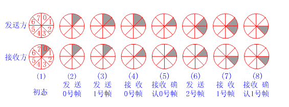
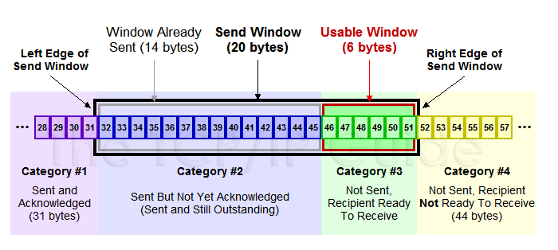
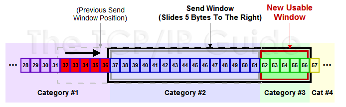

<div align='center'><font size=5>实验3-2：停等机制修改为基于滑动窗口的流量控制机制</font></div>
<div style="margin-left:350px"><font size=4>1811431王鹏</font></div>

[TOC]
# 停等机制修改为基于滑动窗口的流量控制机制
## 摘要
这是我的上机作业3-2的实验报告，请老师查阅，谢谢。代码自3-1的停等协议修改而来
本程序的特点有:
* **将停等机制改成基于滑动窗口的流量控制机制**
* **采用固定窗口大小**
* **支持累积确认**
* **可靠传输机制**

**关键字**：UDP、可靠传输、RUDP、差错检验、超时重传、滑动窗口协议
**程序的基本要求：**
1)下层使用UDP 协议（即使用数据报套接字完成本次程序）；
2)完成客户端和服务器端程序；
3)建立连接、差错检测、确认重传
4)实现可靠的文件传输：能可靠下载文件，能同时下载文件。
## 滑动窗口原理详解
### 窗口机制
滑动窗口协议的基本原理就是在任意时刻，发送方都维持了一个连续的允许发送的帧的序号，称为发送窗口；同时，接收方也维持了一个连续的允许接收的帧的序号，称为接收窗口。发送窗口和接收窗口的序号的上下界不一定要一样，甚至大小也可以不同。不同的滑动窗口协议窗口大小一般不同。发送方窗口内的序列号代表了那些已经被发送，但是还没有被确认的帧，或者是那些可以被发送的帧。下面举一个例子（假设发送窗口尺寸为2，接收窗口尺寸为1）：

分析：
①初始态，发送方没有帧发出，发送窗口前后沿相重合。接收方0号窗口打开，等待接收0号帧；
②发送方打开0号窗口，表示已发出0帧但尚确认返回信息。此时接收窗口状态不变；
③发送方打开0、1号窗口，表示0、1号帧均在等待确认之列。至此，发送方打开的窗口数已达规定限度，在未收到新的确认返回帧之前，发送方将暂停发送新的数据帧。接收窗口此时状态仍未变；
④接收方已收到0号帧，0号窗口关闭，1号窗口打开，表示准备接收1号帧。此时发送窗口状态不变；
⑤发送方收到接收方发来的0号帧确认返回信息，关闭0号窗口，表示从重发表中删除0号帧。此时接收窗口状态仍不变；
⑥发送方继续发送2号帧，2号窗口打开，表示2号帧也纳入待确认之列。至此，发送方打开的窗口又已达规定限度，在未收到新的确认返回帧之前，发送方将暂停发送新的数据帧，此时接收窗口状态仍不变；
⑦接收方已收到1号帧，1号窗口关闭，2号窗口打开，表示准备接收2号帧。此时发送窗口状态不变；
⑧发送方收到接收方发来的1号帧收毕的确认信息，关闭1号窗口，表示从重发表中删除1号帧。此时接收窗口状态仍不变。

若从滑动窗口的观点来统一看待1比特滑动窗口、后退n及选择重传三种协议，它们的差别仅在于各自窗口尺寸的大小不同而已。1比特滑动窗口协议：发送窗口=1，接收窗口=1；后退n协议：发窗口>1，接收窗口>1；选择重传协议：发送窗口>1,接收窗口>1。
### 选择重传协议
效率更高的策略是当接收方发现某帧出错后，其后继续送来的正确的帧虽然不能立即递交给接收方的高层，但接收方仍可收下来，存放在一个缓冲区中，同时要求发送方重新传送出错的那一帧。一旦收到重新传来的帧后，就可以原已存于缓冲区中的其余帧一并按正确的顺序递交高层。这种方法称为选择重发(SELECTICE REPEAT)，其工作过程如图所示。显然，选择重发减少了浪费，但要求接收方有足够大的缓冲区空间。
### 滑动窗口算法
滑动窗口算法工作过程如下。首先，发送方为每1帧赋一个序号`（sequence number）`，记作`SeqNum`。现在，让我们忽略`SeqNum`是由有限大小的头部字段实现的事实，而假设它能无限增大。发送方维护3个变量：发送窗口大小（`send window size`），记作`SWS`
送但未确认的帧数的上界； `LAR`表示最近收到的确认帧`（last acknowledgement received）`的序号；`LFS`表示最近发送的帧`（last frame sent）`的序号，发送方还维持如下的不变式：
```shell
LAR-LFR≤RWS
```
当一个确认到达时，发送方向右移动LAR，从而允许发送方发送另一帧。同时，发送方为所发的每个帧设置一个定时器，如果定时器在ACK到达之前超时，则重发此帧。注意：发送方必须存储最多SWS个帧，因为在它们得到确认之前必须准备重发。 
接收方维护下面3个变量：接收窗口大小`（receive window size）`，记为`RWS`，给出接收方所能接收的无序帧数目的上界；`LAF`表示可接收帧`（largest acceptable frame）`的序号；`LFR`表示最近收到的帧`（last frame received）`的序号。接收方也维持如下不变式：
```shell
LFS-LAR≤SWS 
```
当一个具有顺序号`SeqNum`的帧到达时，接收方采取如下行动：如果`SeqNum<=LFR`或`SeqNum > LAF`，那么帧不在接收窗口内，于是被丢弃；如果`LFR ＜ SeqNum <= LAF`，那么帧在接收窗口内，于是被接收。现在接收方需要决定是否发送一个ACK。设`SeqNum To ACK`表示未被确认帧的最大序号，则序号小于或等于`SeqNum To ACK`的帧都已收到。即使已经收到更高序号的分组，接收方仍确认`SeqNum To ACK`的接收。这种确认被称为是累积的`（cumulative）`。然后它设置`LFR= SeqNumToAck`，并调整`LAF = LFR + RWS`。
### 帮助理解示意图

上图中分成了四个部分，分别是：（**其中那个黑模型就是滑动窗口**）
* #1已收到ack确认的数据
* #2发还没收到ack的
* #3在窗口中还没有发出的（接收方还有空间）
* #4窗口以外的数据（接收方没空间）

**下面是个滑动后的示意图**（收到36的ack，并发出了46-51的字节）：

## 选择重传协议（本实验采取的算法）
### 滑动窗口协议如何工作

使用选择性重复协议实现了滑动窗口协议，该协议要求接收器接收乱序数据。由于此要求，接收方必须能够缓冲数据包。该协议在2种情况下重新传输数据：
1. 接收方从未收到过该数据包，或者已接收到该数据包，但是该数据包的确认（ACK）从未到达发送方。我们假设数据包或ACK在传输中丢失，因此发送方在超时后重新传输数据包。
2. 接收者接收到该数据包，但是该数据包无效，因为它的校验和错误。然后，接收方发送否定确认（NAK）通知发送方立即开始重新传输。

**数据包和缓冲区**
使用滑动窗口协议发送的数据分为最大长度固定的数据包（帧）。每个数据包都有一个唯一的序列号，一旦传输完成，就可以使用该序列号将数据包重新排序为完整的数据。由于要发送的数据可能很大，因此首先将数据划分为缓冲区，然后以每个缓冲区为单位进行传输。在每个缓冲区中，为数据包指定一个从零开始的序列号。因此，要在接收方的缓冲区之间消除歧义，缓冲区大小必须大于窗口大小的两倍。
**发送方**
发件人定义了一个窗口，该窗口由“最后收到的确认” `（LAR）`和“最后发送的帧”`（LFS）`变量标记。首先，发送方在窗口中发送所有数据包，并等待其相应的每个ACK。每次收到ACK时，发送方都会移动其窗口，直到最小的未ACK序列号为`LAR +1`。请注意，每次ACK到达时，窗口都不会移动，这是因为ACK可能会无序到达。因此，仅在可能的情况下才移动窗口。
**接收者**
接收方定义了一个窗口，该窗口由“最后接收的帧”`（LFR）`和“最大可接受的帧”`（LAF）`变量标记。当接收方接受一个帧时，如果校验和有效，它将发送该帧的ACK，否则它将发送NAK。然后，就像发送方一样，接收方将移动其窗口，直到最小的未接收序列号为`LFR + 1`。
### 代码具细
#### 服务器端

```cpp
while (!read_done) {
	int seq_num;
	window_info_mutex.lock();
	window_sent_time = new time_stamp[window_len];
	window_ack_mask = new bool[window_len];
	bool *window_sent_mask = new bool[window_len];
	for (int i = 0; i < window_len; i++) {
		window_ack_mask[i] = false;
		window_sent_mask[i] = false;
	}
	lar = -1;
	lfs = lar + window_len;
	window_info_mutex.unlock();

	bool send_done = false;
	while (!send_done) {
		window_info_mutex.lock();
		if (window_ack_mask[0]) {
			int shift = 1;
			for (int i = 1; i < window_len; i++) {
				if (!window_ack_mask[i]) break;
				shift += 1;
			}
			for (int i = 0; i < window_len - shift; i++) {
				window_sent_mask[i] = window_sent_mask[i + shift];
				window_ack_mask[i] = window_ack_mask[i + shift];
				window_sent_time[i] = window_sent_time[i + shift];
			}
			for (int i = window_len - shift; i < window_len; i++) {
				window_sent_mask[i] = false;
				window_ack_mask[i] = false;
			}
			lar += shift;
			lfs = lar + window_len;
		}
		window_info_mutex.unlock();


		/* Send frames that has not been sent or has timed out */
		for (int i = 0; i < window_len; i++) {
			seq_num = lar + i + 1;

			if (seq_num < splice) {
				window_info_mutex.lock();

				if (!window_sent_mask[i] || (!window_ack_mask[i] && (elapsed_time(current_time(), window_sent_time[i]) > TIMEOUT))) {
					u_char send[50000];//声明要发送的数组
					header* hd = (header*)send;//初始化header
					hd->clientPort = clientPort;
					hd->serverPort = serverPort;
					hd->fileSize = fileSize;
					memcpy(&hd->fileName[0], p, strlen(p));
					hd->fileName[strlen(p)] = '\0';
					int buffer_shift = seq_num * buffer.capacity();
					in.seekg(buffer_shift);
					int restData = fileSize - buffer_shift;  //int restData = fileSize - seq * buffer.capacity();//记录还有多少数据等待发送

					hd->seq = seq_num;//设置头部序列号
					hd->isAck = false;//表明这个包不是ack包
					if (restData < 0)//剩余数据为负，代表传输完成，结束传输
						read_done = true;
					if (restData < buffer.capacity()) {//剩余数据量小于buffer的容量，只读取和剩余数据量等同大小的块
						in.read(buffer.data(), restData); // vector::data -> A pointer to the first element in the array used internally by the vector.
														//读取指定大小的文件进入vector容器，从vector容器中的第一个元素的位置开始写入
						hd->dataLen = restData;//设置此数据报中数据段的长度
						in.setf(std::ios::eofbit);
					}
					else {
						in.read(buffer.data(), buffer.capacity());
						hd->dataLen = buffer.capacity();//设置此数据报中数据段的长度
					}
					u_char* temp = new u_char[buffer.size()];
					std::copy(buffer.begin(), buffer.end(), temp);
					hd->dataLen += 4;
					//char* cbuffer = &buffer[0];//声明一个指向buffer开始地址的指针
					hd->totalLen = hd->dataLen + sizeof(struct header);//设置数据报有效部分总长度 = 数据长度 + 报头长度
					copyDataUchar(temp, send + sizeof(struct header), hd->dataLen);
					hd->checkSum = 0;
					//memcpy(send, hd, sizeof(struct header));//send数组的开始部分设置为数据报头部
					//char* t = &send[sizeof(struct header)];//设置t指向send数组中紧连着头部的第一个地址
					//memcpy(t, cbuffer, buffer.size());//将buffer存入send中头部之后的位置
					hd->checkSum = ChecksumCompute((unsigned short*)hd, hd->totalLen);
					//准备要送出去的东西
					int se = skt.SendTo(send, hd->totalLen, clientPort, _T("127.0.0.1"), 0);//发送send到客户端的相应通信端口

					window_sent_mask[i] = true;
					window_sent_time[i] = current_time();
				}

				window_info_mutex.unlock();
			}
		}
		if (lar >= splice - 1) send_done = true;
	}
}
recv_thread.detach();
delete[] window_ack_mask;
delete[] window_sent_time;
```

#### 客户端
```cpp
// download线程中的函数如下
bool* window_recv_mask = new bool[window_len];
for (int i = 0; i < window_len; i++) {
	window_recv_mask[i] = false;
}
lfr = -1;
laf = lfr + window_len;
...

//processfile处理文件分片函数如下
u_char* temp = &raw[sizeof(struct header)];//创建一个指向数据段起始地址的指针
std::basic_ofstream<u_char> myfile(recvhd->fileName, ios::out | ios::app | ios::binary);


CString file(recvhd->fileName);//更新日志
CString out;
out.Format(L":(seq) %d  ", recvhd->seq);
out = L"\r\n" + out;
out = out + file;
pdlg->displayString(pdlg->m_log, out);
char retchar[4096];
header* hd = (header*)retchar;//生成ACK
hd->clientPort = clientPort;
hd->serverPort = recvhd->serverPort;
hd->isAck = true;
memcpy(&hd->fileName[0], recvhd->fileName, strlen(recvhd->fileName));
hd->fileName[strlen(recvhd->fileName)] = '\0';
hd->dataLen = 0;
hd->seq = recvhd->seq;//确认这个报文被接收了
hd->totalLen = hd->dataLen + sizeof(struct header);
hd->checkSum = 0;
hd->checkSum = ChecksumCompute((unsigned short*)hd, hd->totalLen);
skt.SendTo(retchar, hd->totalLen, recvhd->serverPort, _T("127.0.0.1"), 0);


/*bool *window_recv_mask = new bool[window_len];
for (int i = 0; i < window_len; i++) {
	window_recv_mask[i] = false;
}
lfr = -1;
laf = lfr + window_len;*/

if (recvhd->seq <= laf) {
	if (recvhd->seq == lfr + 1){
		//umap[temp] = recvhd->dataLen-4;
		//myfile.write(temp, recvhd->dataLen - 4);
		int shift = 1;
		for (int i = 1; i < window_len; i++) {
			if (!window_recv_mask[i]) break;
			shift += 1;
		}
		for (int i = 0; i < window_len - shift; i++) {
			window_recv_mask[i] = window_recv_mask[i + shift];
		}
		for (int i = window_len - shift; i < window_len; i++) {
			window_recv_mask[i] = false;
		}
		lfr += shift;
		laf = lfr + window_len;
	}
	else if (recvhd->seq > lfr + 1) {
		if (!window_recv_mask[recvhd->seq - (lfr + 1)]) {
			window_recv_mask[recvhd->seq - (lfr + 1)] = true;
			//umap[temp] = recvhd->dataLen - 4;
			//myfile.write(temp, recvhd->dataLen - 4);
		}
	}
	
}

if (lfr >= (recvhd->fileSize)/MAX_PACKET) { 
	//累计确认，收到的包大于源服务器打包过来的数据报数目时停止循环，并且将内存中的数据写入文件
	for (int i = 0; i < umap.size(); i++) {
		CString out;
		out.Format(L"\r\n %d", umap.size());
		pdlg->displayString(pdlg->m_log, out);
		header* recvhd = (header*)(umap[i]);
		u_char* temp = &umap[i][sizeof(struct header)];
		myfile.write(temp, recvhd->dataLen - 4);
	}
	umap.clear();
	return 1;
}
else
	return 0;
```
#### 累计确认
在客户端中已有体现，收到的包大于源服务器打包过来的数据报数目时停止循环，并且将内存中的数据写入文件
```cpp
if (lfr >= (recvhd->fileSize)/MAX_PACKET) { 
	//累计确认，收到的包大于源服务器打包过来的数据报数目时停止循环，并且将内存中的数据写入文件
	for (int i = 0; i < umap.size(); i++) {
		CString out;
		out.Format(L"\r\n %d", umap.size());
		pdlg->displayString(pdlg->m_log, out);
		header* recvhd = (header*)(umap[i]);
		u_char* temp = &umap[i][sizeof(struct header)];
		myfile.write(temp, recvhd->dataLen - 4);
	}
	umap.clear();
```
总之对于发送方我们维护一个大小为WINDOW_SIZE的序号窗口，这部分数据为已经发送确还未确认的。如果窗口未满，则我们可以继续发送数据包；如果窗口满了，则需要等待ACK确认后窗口的减小，之后才能发送数据包。
## RUDP 协议中的命令

| 客户端指令 | 指令格式     | 含义               |
| ---------- | ------------ | ------------------ |
| 100        | 100          | 请求服务器文件列表 |
| 110        | 110`fileseq` | 请求指定文件       |
| 120        | 120          | 上传文件           |

| 服务器指令 | 指令格式                | 含义                                                         |
| ---------- | ----------------------- | ------------------------------------------------------------ |
| 200        | 200 `filename/filename` | 发送文件列表，文件之间以’/’ 分割                             |
| 220        | 220`serverPort`         | 回复客户端的上传请求，通知客户端<br/>自己将使用`serverPort `端口接收文件 |

## References
* [1] Computer Networks: A Systems Approach (The Morgan Kaufmann Series in Networking) 5th Edition
* [2] 张建忠、徐敬东. 计算机网络技术与应用. 北京清华大学学研大厦 A 座:清华大学出版社, 2019.
* [3] 李建中, 张冬冬.滑动窗口规模的动态调整算法[J].软件学报, 2004, 12 (15) :1800-1814.
