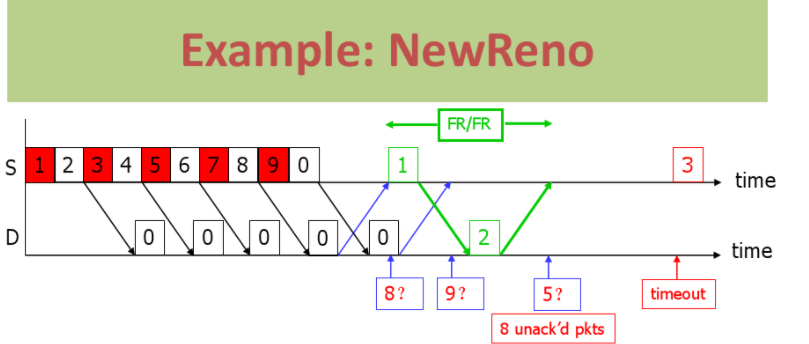

<div align='center'><font size=5>实验3-2：实现拥塞控制算法——Reno算法</font></div>
<div style="margin-left:350px"><font size=4>1811431王鹏</font></div>

> [本次实验实现的算法为Reno算法](Reno算法实现具细)
[TOC]
# 实现拥塞控制算法——Reno算法
## 前期知识储备及名词解释
### 拥塞:
拥塞是指到达通信子网中某一部分的分组数量过多，使得该部分网络来不及处理，以致引起这部分乃至整个网络性能下降的现象，严重时甚至会导致网络通信业务陷入停顿，即出现死锁现象。可以想象在网络中出现了拥塞会造成多么严重的后果。
### 滑动窗口协议
滑动窗口协议:`Sliding Window Protocol`，属于TCP协议的一种应用，用于网络数据传输时的流量控制，以避免拥塞的发生。该协议允许发送方在停止并等待确认前发送多个数据分组。由于发送方不必每发一分组就停下来等待确认，因此该协议可以加速数据的传输，提高网络吞吐量。
### 其他
**拥塞窗口(cwnd)**:`congestion window`，当前端在一个RTT内能发送的窗口大小。
**RTO**:`Retransmission Time Out`，超时重传
**RTT**:`Round-trip time`，往返时间
**ACK**:`Acknowledgement`，我们知道TCP是一个具有可靠性的协议，发送方给接收方发送数据，每收到一个数据包，接收方就会给发送方发送一个确认tcp报文，置ACK为1（ACK是TCP报文中flags之一）
**MSS**:`Management Support System`,最大报文段长度
**ssthresh**：`slow start thresh`，慢启动门限值
## 三种基本拥塞控制算法概览
### `Tahoe`
Tahoe是TCP的最早版本，其主要有三个算法去控制数据流和拥塞窗口。

**Slow Start（慢启动）**
（ssthresh：slow start thresh，慢启动门限值）当cwnd的值小于ssthresh时，TCP则处于slow start阶段，每收到一个ACK，cwnd的值就会加1。仔细分析，其实慢启动并不慢，经过一个RTT的时间，cwnd的值就会变成原来的两倍，实为指数增长。
**Congestion Avoidance（拥塞避免）**
当cwnd的值超过ssthresh时，就会进入Congestion Avoidance阶段，在该阶段下，cwnd以线性方式增长，大约每经过一个RTT，cwnd的值就会加1
**Fast Retransmit（快重传）**
按照拥塞避免算法中cwnd的增长趋势，迟早会造成拥塞（一般通过是否丢包来判断是否发生了拥塞）。如果中网络中发生了丢包，通过等待一个RTO时间后再进行重传，是非常耗时的，因为RTO通常设置得会比较大（避免伪重传：不必要的重传）。

**快重传的思想是**：只要发送方收到了三个重复的ACK（如果不了解三个重复ACK如何产生，请温故一下滑动窗口协议），就会立马重传，而不用等到RTO到达（如果没有3个重复的ACK而包丢失了，就只能超时重传）；并且将ssthresh的值设置为当前cwnd的一半，而cwnd减为1，重回slow start阶段。
***
### `Reno`

除了包含Tahoe的三个算法，Reno多了一个Fast Recovery（快速恢复）算法。
当收到三个重复的ACK或是超过了RTO时间且尚未收到某个数据包的ACK，Reno就会认为丢包了，并认定网络中发生了拥塞。Reno会把当前的`ssthresh`的值设置为当前cwnd的一半，但是并不会回到slow start阶段，而是将cwnd设置为（更新后的）`ssthresh+3MSS`，之后cwnd呈线性增长。

>`Tahoe`和`Reno`的对比图如下


### `newReno`

NewReno是基于Reno的改进版本，主要是改进了快速恢复算法
Reno提出的快速恢复算法提高了包丢失后的吞吐量和健壮性，但缺陷是它只考虑了只丢失一个包的情形，只要丢失了一个包，就被认为是发生了一次拥塞。
在实际的网络中，一旦发生拥塞，会丢弃大量的包。如果采用Reno算法，它会认为网络中发生了多次拥塞，则会多次将cwnd和ssthresh减半，造成吞吐量极具下降，当发送窗口小于3时，将无法产生足够的ACK来触发快重传而导致超时重传，超时重传的影响是非常大的。
在只丢失一个数据包的情况下，NewReno和Reno的处理方法是一致的，而在同一个时间段丢失了多个包时，NewReno做出了改进。Reno快速恢复算法中，发送方只要收到一个新的ACK就会退出快速恢复状态而进入拥塞避免阶段，Neweno算法中，只有当所有丢失的包都重传并收到确认后才退出。
在NewReno中，添加了恢复应答判断功能，使得TCP终端可以区分一次拥塞丢失多个包还是发生了多次拥塞。

记TCP发送端快速恢复阶段中接收到的ACK报文（非冗余ACK）为ACKx
记在接收到ACKx时TCP终端已发出的序列号（SN）最大的报文是PKTy
* 如果ACKx不是PKTy的应答报文，则称报文ACKx为部分应答（Partial ACK，简称PACK）；
* 如果ACKx恰好是PKTy的应答报文则称报文ACKx为恢复应答（Recovery ACK，简称RACK）。

NewReno通过以上两种确认应答来判断是否退出快速恢复阶段。
如果收到的PACK并不会退出快速恢复阶段，直到收到RACK（所有丢失的包都被重发且被接受方收到了）才会退出。

## Reno算法实现具细
**一些初始化**
```cpp
int window_left = 0;
int window_right = 0;
int cwnd = 1;
int ssthresh = 16;
int point = 0;// 改变窗口时已确认的数据seq
int repeat_ack = 0;
int lastSeq = 1;
```
### 慢启动阶段

初始拥塞窗口：`cwnd=1(MSS)`
每个RTT之后,cwnd翻倍(指数增长)
**前提是cwnd < ssthresh**

```cpp
if (window_left - point >= cwnd) {
    point = window_left;
    if (cwnd < ssthresh)
        cwnd *= 2;
    else    ...
```
### 拥塞避免阶段

阈值ssthresh：拥塞窗口达到该阈值时，慢启动阶段结束进入拥塞避免阶段
每个RTT之后,cwnd += 1(线性增长)

```cpp
    ...
    else
        cwnd++;  //线性增长
    cout << "窗口大小增加为" << cwnd << endl;
}
```
### 快速重传和快速恢复
通过三次重复ack检测丢失
阈值`ssthresh = cwnd / 2`
`cwnd = ssthresh + 3`进入拥塞避免阶段（线性增长）
>注：重复`ACK`指明网络仍可以交付一些报文段（拥塞不严重）
```cpp
if (packInfo.ack < packetList.first->head.seq) {
    cout << "！！！！！！！！！！！收到重复ack" << packInfo.ack << endl;
    if (packInfo.ack == flag)
        repeat_ack++;
    else {
        flag = packInfo.ack;
        repeat_ack++;
    }
    if (repeat_ack >= 3) {

        Packet* temp = packetList.first;
        int i = 0;
        while (temp && (i < cwnd)) {
            if (sendto(server_socket, (char*)temp, sizeof(*temp), 0, (SOCKADDR*)&client_addr, client_addr_length) < 0) {
                cout << "发送错误" << endl;
                return 0;
            }
            cout << "快速重传" << temp->head.seq << endl;
            temp->send_time = time(NULL);
            temp = temp->next;
        }
        ssthresh = cwnd / 2;
        cwnd = ssthresh + 3;
        window_right = window_left + 1;
        point = window_left;
        repeat_ack = 0;
    }
    continue;
}
```
### 超时重传
通过超时检测丢失：
阈值`ssthresh = cwnd / 2`
`cwnd = 1`进入慢启动阶段（指数增长）
```cpp
// 接受确认超时，进行重传
if ((time(NULL) - packetList.first->send_time) >= 2) {
    cout << "超时重传" << endl;

    Packet* temp = packetList.first;
    int i = 0;
    while (temp && (i < cwnd)) {
        if (sendto(server_socket, (char*)temp, sizeof(*temp), 0, (sockaddr*)&client_addr, client_addr_length) < 0) {
            cout << "发送错误" << endl;
            return 0;
        }
        cout << "超时重传" << temp->head.seq << endl;
        temp->send_time = time(NULL);
        temp = temp->next;
    }
    ssthresh = cwnd / 2;
    cwnd = 1;
    window_right = window_left + 1;
    point = window_left;
}
```
### 状态FSM


<font size="5" style="font-family: 楷体" >实际测试，有Reno算法拥塞控制传输速率相比无拥塞控制的滑动窗口大大增加:）</font>
***
## References
* [1] Computer Networks: A Systems Approach (The Morgan Kaufmann Series in Networking) 5th Edition
* [2] 张建忠、徐敬东. 计算机网络技术与应用. 北京清华大学学研大厦 A 座:清华大学出版社, 2019.
* [3] 李建中, 张冬冬.滑动窗口规模的动态调整算法[J].软件学报, 2004, 12 (15) :1800-1814.
* [4] https://en.wikipedia.org/wiki/TCP_congestion_control
