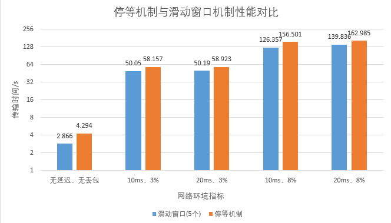
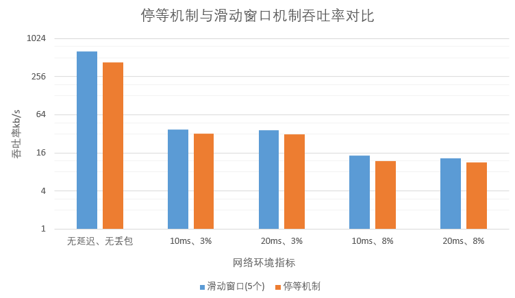
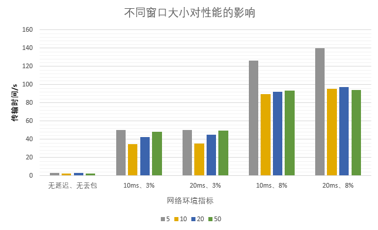
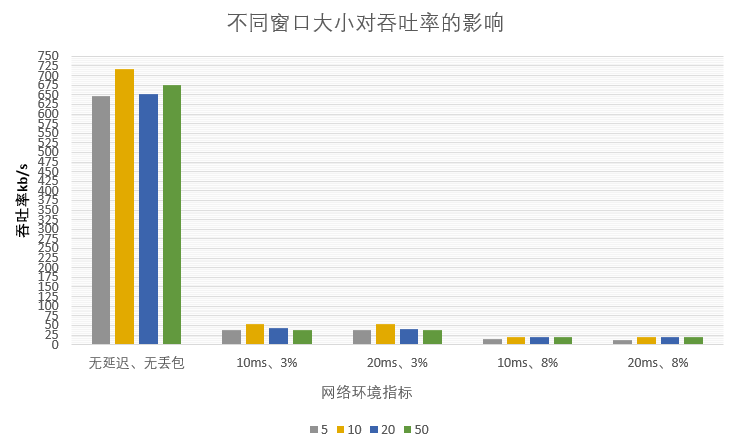
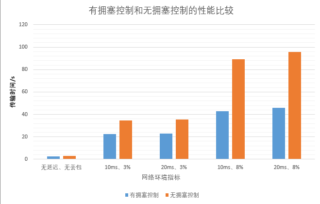
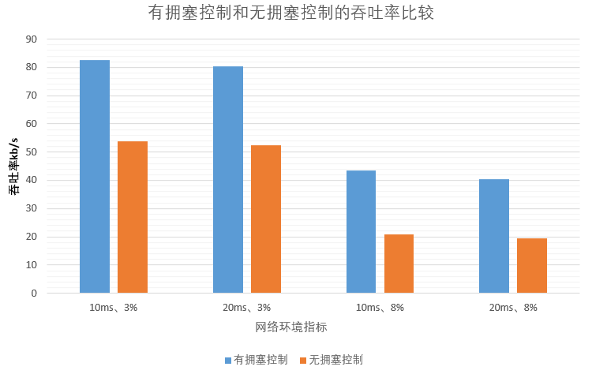

<div align='center'><font size=5>实验3-4：停等、滑动窗口、拥塞控制对比实验</font></div>
<div style="margin-left:350px"><font size=4>1811431王鹏</font></div>

[TOC]

# 停等、滑动窗口、拥塞控制对比实验
## 传输时间和平均吞吐率测试代码
```cpp
clock_t start, end;
size_t fileSize;
...
start = clock();
...
end = clock();
cout << "传输时间为" << (double)(end - start) / CLOCKS_PER_SEC << "秒" << endl;
cout << "平均吞吐率为" << (double)((double)fileSize / ((double)(end - start) / CLOCKS_PER_SEC)) << endl;
```
## 停等机制与滑动窗口机制性能对比
**传输示例图片：1814KB**
### 传输时间和平均吞吐率表格
| 网络环境指标   | 停等机制                 | 滑动窗口(固定窗口大小为5) |
| -------------- | ------------------------ | ------------------------- |
| 无延迟、无丢包 | 4.294s   432546B/s   | 2.866s   648065B/s    |
| 10ms、3%       | 58.157s  31936.9B/s  | 50.05s  37110B/s      |
| 20ms、3%       | 58.923s   31521.7B/s | 50.19s   37006.4B/s   |
| 10ms、8%       | 156.501s 11868B/s    | 126.357s   14699.2B/s |
| 20ms、8%       | 162.985s  11395.9B/s | 139.836s   13282.4B/s |
### 传输时间比较图


### 平均吞吐率比较图


### 结论
选用固定窗口大小为5时，总体上滑动窗口的性能要优于停等机制，尤其是在无延迟无丢包的条件下，滑动窗口传输时间为2.866s，明显比停等机制4.294s快不少。
但是在有丢包的情况下，由于本次实验滑动窗口协议的选择为`GBN回退N帧协议`，因此两者表现均十分一般，滑动窗口协议并没有明显优于停等
## 滑动窗口机制中不同窗口大小对性能的影响
### 传输时间和平均吞吐率表格
| 网络环境指标   | 5                         | 10                     | 20                   | 50                     |
| -------------- | ------------------------- | ---------------------- | -------------------- | ---------------------- |
| 无延迟、无丢包 | 2.866s   648065B/s    | 2.589s   717402B/s | 2.843s    653307B/s | 2.751s   675156B/s |
| 10ms、3%       | 50.05s  37110B/s      | 34.586s   53702.5B/s  | 42.246s   43965.2B/s | 48.545s   38260.4B/s   |
| 20ms、3%       | 50.19s   37006.4B/s   | 35.412s   52449.8B/s   | 45.163s    41125.5B/s | 49.482s   37535.9B/s   |
| 10ms、8%       | 126.357s   14699.2B/s | 89.391s   20777.9B/s   | 92.038s    20180.3B/s | 93.201s   19928.5B/s   |
| 20ms、8%       | 139.836s   13282.4B/s | 95.662s   19415.8B/s   | 97.695s   19011.8B/s | 94.335s   19688.9B/s   |
### 传输时间比较图


### 平均吞吐率比较图


### 结论
窗口大小的选择为5、10、20、50，可以看到性能是一个递增又递减的过程。因为在初期随着滑动窗口的数量增加，发送方传输数据的并发度增加，因此表现出良好的递增趋势。但是滑动窗口增大到一定值时，因为窗口数过大，一次性发送太多的数据包可能会导致丢包现象的发生（导致超时重传），这是非常耗时，得不偿失的。因此窗口数增大到一定值时，性能下降。
## 有拥塞控制和无拥塞控制的性能比较
### 传输时间和平均吞吐率表格
| 网络环境指标   | 无拥塞控制             | 有拥塞控制       |
| -------------- | ---------------------- | ---------------- |
| 无延迟、无丢包 | 2.843s   653307B/s | 2.709s  685623B/s |
| 10ms、3%       | 34.586s   53702.5B/s   | 22.48s   82622.5B/s |
| 20ms、3%       | 35.412s  52449.8B/s    | 23.096s   80418.8B/s |
| 10ms、8%       | 89.391s   20777.9B/s   | 42.786s  43410.3B/s |
| 20ms、8%       | 95.662s   19415.8B/s   | 45.898s   40467B/s |
### 传输时间比较图


### 平均吞吐率比较图


### 结论
此处将无拥塞控制的窗口数设为了10个（表现最好的一组滑动窗口），但是在有丢包和延迟的时候，性能仍远不足有拥塞控制的一方。这是因为拥塞控制的一方采用Reno算法，不仅会探测接收方的网络拥堵情况从而将窗口设置为合适的大小。而且产生丢包现象时，快速重传和快速恢复策略（收到三个`duplicate ack`就重发数据包）是明显要优于超时重传的。
## References
* [1] Computer Networks: A Systems Approach (The Morgan Kaufmann Series in Networking) 5th Edition
* [2] 张建忠、徐敬东. 计算机网络技术与应用. 北京清华大学学研大厦 A 座:清华大学出版社, 2019.
* [3] 李建中, 张冬冬.滑动窗口规模的动态调整算法[J].软件学报, 2004, 12 (15) :1800-1814.
* [4] https://en.wikipedia.org/wiki/TCP_congestion_control

