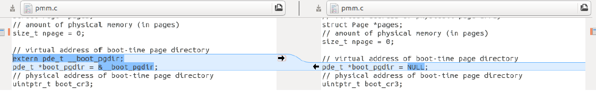

[TOC]

# ucoreOS操作系统实验——Lab3

## 问题发现&&改进

在合并lab1/2/3时，在pmm.c中，对boot_pgdir的赋值不同，理论上这块儿是没有经过改动的，不知道是不是因为代码的版本不一样，所以出现差别。


- 看到了很好的打patch的方法解决merge的时候的冲突问题，学习一下：

  ```bash
  diff -r -u -P lab2_origin lab2 > lab2.patch
  cd lab3
  patch -p1 -u < ../lab2.patch
  ```

  基本上就好啦，但是lab3就是还有问题，然后我又手动补足了一下。。。

- 最一开始并没直接看懂help comment，再加上想做一个Challenge所以就细致学习一下实验书后面的页面置换机制！！顺便复习一下上课内容\_(:з」∠)_

---

- page fault原因

  - 目标页帧不存在（页表项全为0，即该线性地址与物理地址尚未建立映射或者已经撤销)；
  - 相应的物理页帧不在内存中（页表项非空，但Present标志位=0，比如在swap分区或磁盘文件上)，这在本次实验中会出现，我们将在下面介绍换页机制实现时进一步讲解如何处理；
  - 不满足访问权限(此时页表项P标志=1，但低权限的程序试图访问高权限的地址空间，或者有程序试图写只读页面).

- 换出页的特征：映射到用户空间且被用户程序直接访问的页面才能被交换，内核直接使用的内核空间的页面不能被换出(宫老师上课讲的例子哈哈哈)

- 页被置换到硬盘上的8个扇区(0.5KB/扇区)，PTE_P就用来表示与物理页的映射关系，为0就在硬盘

  > 实验三可以保存262144/8=32768个页，即128MB的内存空间。swap 分区的大小是 swapfs_init 里面根据磁盘驱动的接口计算出来的，目前 ucore 里面要求 swap 磁盘至少包含 1000 个 page，并且至多能使用 1<<24 个page

- Page fault时换入，换出则分为积极和消极两种策略，积极就是定时或空闲时就进行以保证总是够用的；消极是只有在没有空闲页分配时才进行换出，lab3显然是消极的

---

- 此外，这次代码量比前两次都少好多，唯一的问题是，在写challenge的时候我本来只想在fifo里面改并把fifo manager换成我写好的enhanced_clock就行但是总是报一个空行的神奇的错？？所以看网上大佬都是另外写了一套manager所以我就还是像上一次伙伴系统一样又新写了一个manager类就神奇的好了？？？

## 练习0

> 以后每次都是要基于前一次lab的工作才能继续，感觉整体上是一个由浅至深搭建一个OS的过程

由于前一次Meld还有Git的merge让人很迷乱，以及并不会用patch，这次之后去学习一下。所以这次依然是选择手动merge(这么看下来其实前两个lab也并没有写太多代码，主要是基础知识的补足太多了\_(:з」∠)_)

## 练习一

>  **给未被映射的地址映射上物理页（需要编程）**
>
> 完成do_pgfault（mm/vmm.c）函数，给未被映射的地址映射上物理页。设置访问权限 的时候需要参考页面所在 VMA 的权限，同时需要注意映射物理页时需要操作内存控制 结构所指定的页表，而不是内核的页表。注意：在LAB3 EXERCISE 1处填写代码。

do_pgfault()是用来中断以处理缺页异常的函数，涉及mm和vma两个数据结构，它们是用来描述不在物理内存中的“合法”虚拟页的数据结构。

由于这些虚拟页实际上并没有被分配，所以访问这些虚拟页的时候会出现pagefault异常，而do_pgfault()的功能就是在处理异常的时候完成对其的物理页分配映射，而在中断返回后就可以正常对这些虚拟页进行访问 

### 两个重要的数据结构

```cpp
struct mm_struct { // 描述一个进程的虚拟地址空间
    list_entry_t mmap_list;        // 链接同一Directory的虚拟内存空间的双向链表头节点 
    struct vma_struct *mmap_cache; // 当前正在使用的虚拟内存空间
    pde_t *pgdir;                  // 该数据结构所对应的页表地址(用以找PTE)
    int map_count;                 // 虚拟内存块的数目
    void *sm_priv;                 // 记录访问情况链表头地址(用于置换算法)
};
struct vma_struct { // 虚拟内存空间
    struct mm_struct *vm_mm; // 虚拟内存空间所属的进程
    uintptr_t vm_start; // 连续地址的虚拟内存空间的起始位置和结束位置
    uintptr_t vm_end;
    uint32_t vm_flags; // 虚拟内存空间的属性 (读/写/执行)
    list_entry_t list_link; // 双向链表    从小到大将虚拟内存空间链接起来
};
```

### page fault处理流程

> 参照do_pgfault()注释给出的CALL GRAPH：trap--> trap_dispatch-->pgfault_handler-->do_pgfault

- 前两步和其它中断的处理一致，硬件将程序状态字压入中断栈，与ucore中的部分中断处理代码一起建立一个trapframe，同时硬件还会将出现了异常的线性地址保存在cr2寄存器中(lab1&2涉及了许多)
- 之后来到trap_dispatch()，根据其对应中断号，将它交给pgfault_handler()(trap.c中检查mm结构不为空以后交给do_pgfault())处理，pgfault_handler()再交给do_pgfault()，即我们要编程的部分

### 实现

do_pgfault()的第三个参数是一个保存在cr2寄存器（页故障线性地址寄存器)中的线性地址，也就是出现了page fault的线性地址，第二个参数是记在trapframe里面的硬件产生的error code，第一个参数是pgfault_handler()传过来的mm数据结构，它将PDT保存在链表中(数据结构定义见vmm.h)

1. 首先查询mm_struct中的合法的虚拟地址链表(vma)，用于确定当前出现page fault的线性地址是否合法，合法则继续，反之直接返回；
```cpp
int
do_pgfault(struct mm_struct *mm, uint32_t error_code, uintptr_t addr) {
    int ret = -E_INVAL;
    //try to find a vma which include addr
    struct vma_struct *vma = find_vma(mm, addr);
    //找到对应地址和mm的vma
    pgfault_num++;
    //If the addr is in the range of a mm's vma?
    if (vma == NULL || vma->vm_start > addr) {//不合法地址或不在范围内
        cprintf("not valid addr %x, and  can not find it in vma\n", addr);
        goto failed;
    }
```

2. 检查error code(switch(error_code&3))：因为按照注释中的内容我们其实只需要检查0-1位，所以是&3，可写且存在的页就是3，如果是其他不满足我们要映射物理页的要求的时候就打印错误并直接返回

```cpp
  switch (error_code & 3) {
  default://默认3即合理的
          /* error code flag : default is 3 ( W/R=1, P=1): write, present */
          //以下是各种形式的报错
  case 2: /* error code flag : (W/R=1, P=0): write, not present */
      if (!(vma->vm_flags & VM_WRITE)) {
          cprintf("do_pgfault failed: error code flag = write AND not present, but the addr's vma cannot write\n");
          goto failed;
      }
      break;
  case 1: /* error code flag : (W/R=0, P=1): read, present */
      cprintf("do_pgfault failed: error code flag = read AND present\n");
      goto failed;
  case 0: /* error code flag : (W/R=0, P=0): read, not present */
      if (!(vma->vm_flags & (VM_READ | VM_EXEC))) {
          cprintf("do_pgfault failed: error code flag = read AND not present, but the addr's vma cannot read or exec\n");
          goto failed;
      }
  }
```

3. 接下来根据合法虚拟地址（mm_struct中保存的合法虚拟地址链表中可查询到）的标志，来生成对应产生的物理页的权限
```cpp
  uint32_t perm = PTE_U;
  if (vma->vm_flags & VM_WRITE) {  //VM_WRITE   0x00000002
      perm |= PTE_W;    //可写的
  }
  addr = ROUNDDOWN(addr, PGSIZE);
  //把原来的addr按PSIZE=4096的倍数向下舍去
  ret = -E_NO_MEM;//E_NO_MEM 4 因为内存不足请求失败

  pte_t *ptep=NULL;
```

4. 之后就是要代码实现的部分(依然是借助和按照help comment的实现)

   相关宏定义及函数：

   ```c
   get_pte //pmm.c lab2完成的根据虚拟线性地址返回pte的函数,如果不存在就分配一个
   pgdir_alloc_page //分配一个物理页并将它与其对应的虚拟地址建立映射关系
   VM_WRITE  //vmm.h   =0x00000002 即vm_flags第1位,1可写0只读
   PTE_W   PTE_U//同lab2分别表示一级/二级页表是否可写 用户是否有访问权
   mm->pgdir    //vmm.h   vma的对应PDT
   ```

   练习一的实现很简单：

   1. 获取发生缺页的虚拟地址
   2. 如果需要的物理页是没有被分配的分配物理页并将其与虚拟页建立映射关系,perm 是⼀个PTE可写标志位
```cpp
  ptep = get_pte(mm->pgdir, addr, 1); 
  if (*ptep == 0) { 
      // 如果需要的物理页是没有分配(没有映射)且没有被换出到外存中
      //addr就是前面的经过rounddown的虚拟页地址
      //perm 是前面PTE_W   PTE_U处理后有权限的flag
      struct Page* page = pgdir_alloc_page(mm->pgdir, addr, perm); 
      // 分配物理页，并且与对应的虚拟页建立映射关系
  }  
```

### 回答问题

> 1. 请描述页目录项（Page Directory Entry）和页表项（Page Table Entry）中组成部分对ucore实现页替换算法的潜在用处。
> 2. 如果ucore的缺页服务例程在执行过程中访问内存，出现了页访问异常，请问硬件要做哪些事情？

- PDE和PTE中的低位都有许多保留位以供操作系统使用，OS可以利用这些位来完成一些其他的内存管理相关的算法，比如在这里保存最近一段时间内该页被访问的次数，可以借助位判断实现Enhanced Clock算法。这些保留位有利于OS进行功能的拓展
- Page Fault的缺页异常应与正常出现页访问异常的处理相一致
  - 将发生错误的线性地址保存在cr2寄存器中;
  - 在中断栈中依次压入EFLAGS，CS, EIP，以及页访问异常码error code，由于ISR一定是运行在内核态下的，因此不需要压入ss和esp以及进行栈的切换；
  - 根据中断描述符表查询到对应页访问异常的ISR，跳转到对应的ISR处执行，接下来将由软件进行处理；

## 练习二

> 完成vmm.c中的do_pgfault函数，并且在实现FIFO算法的swap_fifo.c中完成map_swappable和swap_out_victim函数。通过对swap的测试。注意：在LAB3 EXERCISE 2处填写代码

### do_pgfault()步骤

- 已知该物理页被换到外存，首先判断是否对交换机制进行了正确的初始化
- 根据mm和addr提供的信息将虚拟页对应的物理页从外存换入内存
- 给换入的物理页与虚拟页建立映射关系
- 将物理页设置为可被换出

相关宏及函数

```c
swap_in(mm, addr, &page) //swap.c 将物理页换入内存
page_insert   //pmm.c  建立物理页与虚拟页之间的映射关系
swap_map_swappable //swap.c 将物理页设为可交换的
```

### FIFO流程

通过分析👆的do_pgfault()发现我们首先要实现swap_fifo.c里面的FIFO置换算法

- 为了管理所有可交换的物理页，用一个链表pra_list_head来记录它们
- 把mm的sm_priv指向pra_list_head的地址，这样就可以通过mm访问
- 把最近到达的物理页链接pra_list_head的最后(编程)
- 函数名取得很形象hh找出要被换出去的受害者页(编程)

### 实现

#### do_pgfault()部分：

```CPP
  else {
      if (swap_init_ok) { // 判断交换机制是否正确初始化swapinit后会将该变量置1
          struct Page *page = NULL;
          swap_in(mm, addr, &page); //将物理页换入到内存中
          page_insert(mm->pgdir, page, addr, perm); //将物理页与虚拟页建立映射关系
          swap_map_swappable(mm, addr, page, 1); // 设置当前的物理页为可交换的
          page->pra_vaddr = addr; 
          // 同时在物理页中维护其对应到的虚拟页的信息
          // pra_vaddr用来记录此物理页对应的虚拟页起始地址        
      } 
      else {
          cprintf("no swap_init_ok but ptep is %x, failed\n",*ptep);
          goto failed;
      }
  }
```

####  FIFO

##### _fifo_map_swappable：

因为FIFO基于双向链表实现，所以加到链表的最后其实只用list_add_before将它加到head的前面就可以了

```cpp
static int
_fifo_map_swappable(struct mm_struct *mm, uintptr_t addr, struct Page *page, int swap_in)
{
    list_entry_t *head=(list_entry_t*) mm->sm_priv;// 找到链表入口
    list_entry_t *entry=&(page->pra_page_link);//找到当前物理页用于组织成链表的list_entry_t
    assert(entry != NULL && head != NULL);
    //record the page access situlation
    /*LAB3 EXERCISE 2: YOUR CODE*/ 
    //(1)link the most recent arrival page at the back of the pra_list_head qeueue.
    list_add_before(head,entry); // 将当前指定的物理页插入到链表的末尾
    return 0;
}
```

##### _fifo_swap_out_victim

根据FIFO思想，找出最先访问即第一个进入链表的也就是头结点并删掉就好了

```cpp
static int
_fifo_swap_out_victim(struct mm_struct *mm, struct Page ** ptr_page, int in_tick)
{
     list_entry_t *head=(list_entry_t*) mm->sm_priv;// 找到链表的入口
     assert(head != NULL);
     assert(in_tick==0);
     /* Select the victim */
     /*LAB3 EXERCISE 2: YOUR CODE*/ 
     //(1)  unlink the  earliest arrival page in front of pra_list_head qeueue
     //(2)  set the addr of addr of this page to ptr_page
     list_entry_t *le = list_next(head); // 取出链表头，即最先进入的物理页
     assert(le != head); // 确保不是head
     //pra_page_link是Page结构中用来构造按第一次访问时间排序的链表
     struct Page *page = le2page(le, pra_page_link);//找到其对应的物理页的Page结构
     list_del(le); // 从链表上删除将被换出的物理页
     *ptr_page = page;
     return 0;
}
```

### 回答问题

> 如果要在ucore上实现"extended clock页替换算法"请给你的设计方案，现有的swap_manager框架是否足以支持在ucore中实现此算法？如果是，请给你的设计方案。如果不是，请给出你的新的扩展和基此扩展的设计方案。并需要回答如下问题：
>
> 1. 需要被换出的页的特征是什么？
> 2. 在ucore中如何判断具有这样特征的页？
> 3. 何时进行换入和换出操作？

- 问题

  - 被换出的页特征
    - 该物理页在当前指针上一次扫过之前没有被访问；
    - 该物理页的内容与其在外存中保存的数据是一致的, 即没有被修改过的;
  - 如何判断
    - 当内存页被访问后，MMU将在对应的页表项的`PTE_A`置1(Access)
    - 当内存页被修改后，MMU将在对应的页表项的`PTE_D`置1(Dirty)
  - 何时操作
    - 在产生缺页现象page fault中断的时候进行换入操作
    - 当位于物理页框中的内存被页面替换算法所选择时，需要进行换出操作

- 可以实现

  根据上述回答，只需要重写swap_out_victim

  - 从当前指针开始，对双向链表进行扫描，根据指针指向的物理页的状态（(access, dirty)）来确定应当进行何种修改
    - 状态为(0, 0)，则将该物理页面从链表删除，该物理页记为换出页，但是由于这个时候这一页不是dirty的，因此不需要将其写入swap分区
    - 状态为(0, 1)，则将该物理页对应的虚拟页的PTE中的dirty位都改成0，并将该物理页写入外存中，然后指针跳转到下一个物理页
    - 如果状态是(1, 0), 将该物理页对应的虚拟页的PTE中的访问位都置成0，然后指针跳转到下一个物理页面
    - 如果状态是(1, 1)，则该物理页的所有对应虚拟页的PTE中的访问为置成0，然后指针跳转到下一个物理页面


## Challenge1

> ###### 实现识别dirty bit的 extended clock页替换算法

根据MOOC总结下来就是

- 按照上面回答问题的记录(access, dirty)状态的办法只需要最多循环三次就可以找到更为合适的替换页
- 如果访问该页，就将标记改为(1,0)；写该页改成(1,1)；
- 此时需要替换页时，有(0,0)状态直接替换；如果没有将(1,1)改为(1,0)，(1,0)改为(0,0)，直到找到为止

### 实现

还是同lab2一样仿写，照着swap_fifo再写一个swap_clock即可

```cpp
static int
_extended_clock_swap_out_victim(struct mm_struct *mm, struct Page ** ptr_page, int in_tick)
{
    list_entry_t *head = (list_entry_t*)mm->sm_priv;
    assert(head != NULL);
    assert(in_tick == 0);
    list_entry_t *le = head->prev;
    assert(head != le);

    int i; // 循环三次 寻找合适的置换页
    for (i = 0; i < 3; i++) {
        /* 第一次循环 寻找 没被访问过的 且 没被修改过的 同时将被访问过的页的 访问位 清 0
            第二次循环 依然是寻找 没被访问过的 且 没被修改过的 因为到了此次循环 访问位都被清 0 了 不存在被访问过的
            只需要找没被修改过的即可 同时将被修改过的页 修改位 清 0
            第三次循环 还是找 没被访问过 且 没被修改过的 此时 第一次循环 已经将所有访问位 清 0 了
             第二次循环 也已经将所有修改位清 0 了 故 在第三次循环 一定有 没被访问过 也没被修改过的 页
        */
        while (le != head) {
            struct Page *page = le2page(le, pra_page_link);            
            pte_t *ptep = get_pte(mm->pgdir, page->pra_vaddr, 0);

            if (!(*ptep & PTE_A) && !(*ptep & PTE_D)) { // 没被访问过 也没被修改过 
                list_del(le);
                *ptr_page = page;
                return 0;
            }
            if (i == 0) {
                *ptep &= 0xFFFFFFDF;
            } else if (i == 1) {
                *ptep &= 0xFFFFFFBF;
            }
            le = le->prev;
        }
        le = le->prev;
    }
}
```

并在页面置换算法中使用它
```cpp
int
swap_init(void)
{
     swapfs_init();

     if (!(1024 <= max_swap_offset && max_swap_offset < MAX_SWAP_OFFSET_LIMIT))
     {
          panic("bad max_swap_offset %08x.\n", max_swap_offset);
     }
     

     sm = &swap_manager_clock;   //换成clock
     int r = sm->init();
     
     if (r == 0)
     {
          swap_init_ok = 1;
          cprintf("SWAP: manager = %s\n", sm->name);
          check_swap();
     }

     return r;
}
```